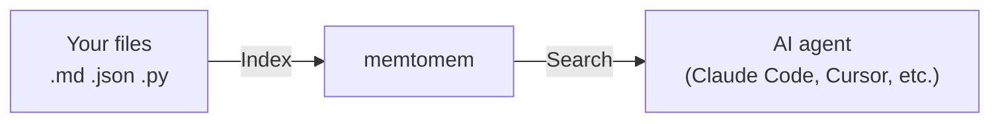
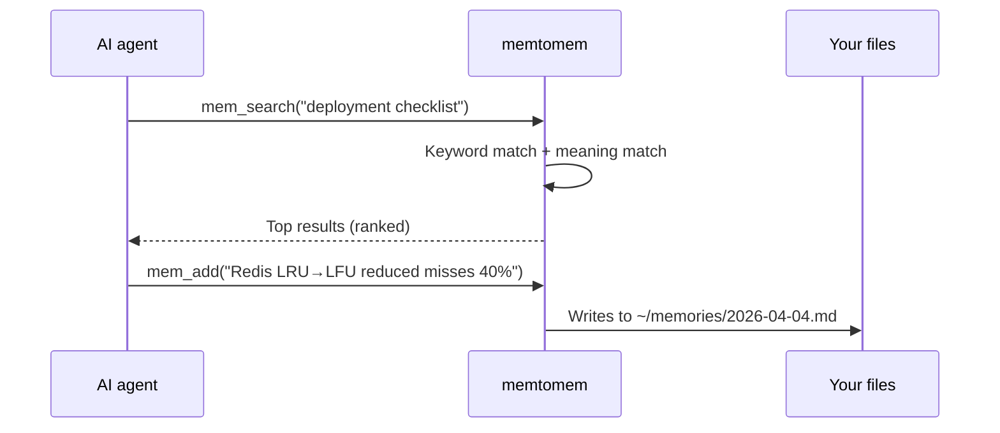
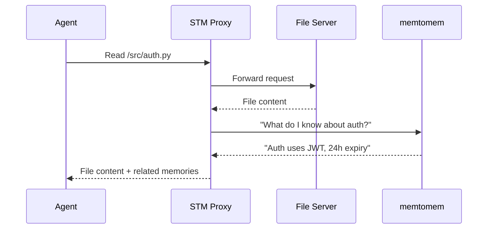

# memtomem

[](https://python.org)
[](LICENSE)

**Give your AI agent a long-term memory.**

memtomem turns your markdown notes, documents, and code into a searchable knowledge base that any AI coding agent can use. Write notes as plain `.md` files — memtomem indexes them and makes them searchable by both keywords and meaning.



> **First time here?** Follow the [Getting Started](docs/guides/getting-started.md) guide — you'll have a working setup in under 5 minutes.

---

## Why memtomem?

| Problem | How memtomem solves it |
|---------|------------------------|
| AI forgets everything between sessions | Index your notes once, search them in every session |
| Keyword search misses related content | Hybrid search: exact keywords + meaning-based similarity |
| Notes scattered across tools | One searchable index for markdown, JSON, YAML, Python, JS/TS |
| Vendor lock-in | Your `.md` files are the source of truth. The DB is a rebuildable cache |

---

## Quick Start (5 minutes)

### Step 1: Prerequisites

- **Python 3.12+** ([python.org](https://python.org))
- **Ollama** ([ollama.com](https://ollama.com)) — runs embedding models locally, for free

```bash
ollama pull nomic-embed-text    # download the default embedding model (~270MB)
```

> **No GPU or prefer cloud?** Skip Ollama — use OpenAI embeddings instead. The setup wizard (`mm init`) will guide you.

### Step 2: Connect to your AI editor

Choose your editor:

**Claude Code** (recommended):
```bash
claude mcp add memtomem -s user -- uvx --from memtomem memtomem-server
```

**Cursor / Windsurf / Claude Desktop** — add to your MCP config file ([paths here](docs/guides/mcp-clients.md)):
```json
{
  "mcpServers": {
    "memtomem": {
      "command": "uvx",
      "args": ["--from", "memtomem", "memtomem-server"],
      "env": { "MEMTOMEM_INDEXING__MEMORY_DIRS": "~/notes" }
    }
  }
}
```

> **Important**: Use `memtomem-server` (the MCP server), not `memtomem` (the CLI tool).

### Step 3: Run the setup wizard

```bash
mm init
```

The interactive wizard walks you through 7 steps:

1. **Embedding provider** — Ollama (local, free) or OpenAI (cloud)
2. **Memory directory** — where your notes live (e.g., `~/notes`)
3. **Storage** — SQLite database path
4. **Namespace** — auto-organize memories by folder name
5. **Search** — results per query, time-decay toggle
6. **Language** — tokenizer (Unicode or Korean)
7. **Editor connection** — auto-configure your AI editor

Each step supports `b` (back) and `q` (quit) for navigation.

### Step 4: Index and search

In your AI editor, ask:
```
"Index my notes folder"  →  mem_index(path="~/notes")
"Search for deployment"  →  mem_search(query="deployment checklist")
"Remember this insight"  →  mem_add(content="...", tags="ops")
```

Or use the CLI:
```bash
mm index ~/notes                # index your files
mm search "deployment"          # hybrid search (keywords + meaning)
mm add "some insight" --tags ops  # save a memory
```

That's it! Your agent now has long-term memory.

---

## Key Features

### Long-Term Memory (LTM) — Search & Index

Your files become a searchable knowledge base. Hybrid search combines keyword matching (BM25) with meaning-based similarity (embedding vectors) for the best of both worlds.



### Short-Term Memory (STM) — Proactive Surfacing

Optional, distributed as a separate package. STM proxy sits between your agent and other MCP tools. When the agent reads files or calls APIs, STM automatically surfaces relevant memories from memtomem — no manual searching needed.



STM lives in its own repository: **[memtomem/memtomem-stm](https://github.com/memtomem/memtomem-stm)**. Communication with memtomem core happens entirely through the MCP protocol — no direct code coupling.

### Agent Context Sync — One Source, All Editors

Write project rules once in `.memtomem/context.md`, then generate config files for every AI editor automatically.

```bash
mm context init                      # extract from existing CLAUDE.md, .cursorrules, etc.
mm context generate --agent all      # generate for all editors
mm context sync                      # keep in sync after edits
```

---

## CLI Reference

All commands support `-h` and `--help`. Use `b` (back) and `q` (quit) in interactive wizards.

```bash
mm init                    # 7-step setup wizard
mm search "query"          # hybrid search
mm index ~/notes           # index files
mm add "note" --tags tag   # add a memory
mm recall --since 2026-04  # recall by date
mm config show             # view settings
mm config set key value    # change a setting
mm embedding-reset         # check/resolve embedding model mismatch
mm context detect          # find agent config files
mm shell                   # interactive REPL
mm web                     # Web UI (http://localhost:8080)
```

---

## More Features

| Feature | Description | Learn more |
|---------|-------------|------------|
| **Agent memory** | Sessions, working memory, procedures, multi-agent, reflection | [Agent Memory Guide](docs/guides/agent-memory-guide.md) |
| **Namespaces** | Organize memories into scoped groups (work, personal, project) | [User Guide](docs/guides/user-guide.md#4-namespace--mem_ns_) |
| **Web UI** | Visual dashboard — search, browse, tags, sessions, health monitoring | [Web UI Guide](docs/guides/web-ui.md) |
| **72 MCP tools** | Core 9 tools + `mem_do` meta-tool routing to 63 actions | [Tool Reference](packages/memtomem/README.md) |
| **Maintenance** | Dedup, auto-tag, decay, consolidation, export/import | [User Guide](docs/guides/user-guide.md#5-maintenance--mem_dedup_-mem_decay_-mem_auto_tag) |

---

## Embedding Models

| Model | Provider | Dimension | Best for |
|-------|----------|-----------|----------|
| `nomic-embed-text` (default) | Ollama | 768 | General English, lightweight |
| `bge-m3` | Ollama | 1024 | Multilingual, higher accuracy |
| `text-embedding-3-small` | OpenAI | 1536 | Cloud-based, no GPU needed |
| `text-embedding-3-large` | OpenAI | 3072 | Best accuracy |

Switch models via `mm init` or `mm embedding-reset`.

---

## Documentation

| Guide | Who it's for |
|-------|-------------|
| [Getting Started](docs/guides/getting-started.md) | **Start here** — install, setup wizard, first use |
| [Hands-On Tutorial](docs/guides/hands-on-tutorial.md) | Follow-along with example files |
| [User Guide](docs/guides/user-guide.md) | Complete feature walkthrough |
| [MCP Client Setup](docs/guides/mcp-clients.md) | Editor-specific configuration |
| [Agent Memory Guide](docs/guides/agent-memory-guide.md) | Sessions, working memory, procedures |
| [memtomem-stm](https://github.com/memtomem/memtomem-stm) | Optional STM proxy for proactive memory surfacing (separate package) |
| [Tool Reference](packages/memtomem/README.md) | All 72 tools with parameters |
| [Web UI Guide](docs/guides/web-ui.md) | Visual dashboard |

---

## Glossary

| Term | Meaning |
|------|---------|
| **MCP** | Model Context Protocol — a standard for connecting AI editors to external tools |
| **Embedding** | A numeric vector that captures the meaning of text, used for similarity search |
| **BM25** | Traditional keyword search algorithm (like Google, but local) |
| **Hybrid search** | Combines BM25 keywords + embedding similarity for better results |
| **Chunk** | A section of a file (e.g., one heading in a markdown file) — the unit of search |
| **Namespace** | A label to organize memories into groups (e.g., "work", "personal") |
| **STM** | Short-Term Memory proxy — automatically surfaces relevant memories. Distributed as a [separate package](https://github.com/memtomem/memtomem-stm) |

---

## Contributing

```bash
git clone https://github.com/memtomem/memtomem.git
cd memtomem
uv venv --python 3.12 && source .venv/bin/activate
uv pip install -e "packages/memtomem[all]"
uv run pytest                            # 886 tests (core only — STM has its own repo)
uv run ruff check packages/memtomem/src  # lint
```

---

## License

[Apache License 2.0](LICENSE)
