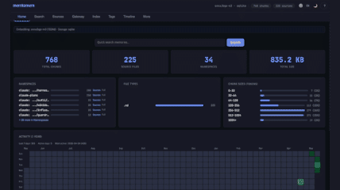
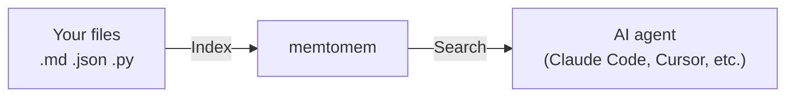

# memtomem

> Markdown-first long-term memory for AI coding agents — your files stay yours, and core usage is hook-free by default.

[](https://pypi.org/project/memtomem/)
[](https://pypi.org/project/memtomem/)
[](https://github.com/memtomem/memtomem/stargazers)
[](https://python.org)
[](LICENSE)
[](CLA.md)
[](https://data.safetycli.com/packages/pypi/memtomem)

> 🚧 **Alpha** — APIs, defaults, and on-disk config surfaces may still change between `0.x` releases. Feedback and issue reports are especially welcome: [Issues](https://github.com/memtomem/memtomem/issues) · [Discussions](https://github.com/memtomem/memtomem/discussions).

<p align="center">
  
</p>

memtomem turns your markdown notes, documents, and code into a searchable knowledge base that any AI coding agent can use. Write notes as plain `.md` files — memtomem indexes them and makes them searchable by both keywords and meaning.



> **First time here?** Follow the [Getting Started](docs/guides/getting-started.md) guide — you'll have a working setup in under 5 minutes. Claude Code or Codex CLI user? See the [Korean vibe-coding quickstart](docs/guides/vibe-coding-getting-started-ko.md).

---

## Why memtomem?

| Problem | How memtomem solves it |
|---------|------------------------|
| AI forgets everything between sessions | Index your notes once, search them in every session |
| Keyword search misses related content | Hybrid search: exact keywords + meaning-based similarity |
| Notes scattered across tools | One searchable index for markdown, JSON, YAML, Python, JS/TS |
| Vendor lock-in | Your `.md` files are the source of truth. The DB is a rebuildable cache |
| Hidden automation is hard to reason about | Core memory operations run only when you call them; optional client hooks are explicit, removable integrations |

---

## Quick Start

### 1. Install

```bash
uv tool install 'memtomem[all]'       # or: pipx install 'memtomem[all]'
mm --version                          # verify install
```

`[all]` bundles the features the sections below describe — ONNX dense embeddings, Korean tokenizer, Ollama / OpenAI providers, code chunker, and the Web UI. For a BM25-only install without those downloads (~40 MB vs ~250 MB), see the [minimal install option](docs/guides/getting-started.md#option-a-from-pypi-recommended-for-most-users) in the Getting Started guide.

> If `mm --version` shows an older version than the [latest release](https://github.com/memtomem/memtomem/releases), `uv` is likely serving cached PyPI metadata — re-run with `uv tool install 'memtomem[all]' --refresh`, or clear the cache first: `uv cache clean memtomem`.

> **`mm: command not found`?** `uv tool install` drops the shim into `~/.local/bin`, which isn't on `$PATH` in fresh shells on macOS/Linux. Run `uv tool update-shell`, then open a new shell and re-run `mm --version`.

### 2. Setup

```bash
mm init                               # preset picker, then memory_dir + MCP
```

The interactive picker starts with three presets — **Minimal** (BM25, no downloads), **English (Recommended)** (ONNX `bge-small-en-v1.5` + English reranker + auto-discover providers), **Korean-optimized** (ONNX `bge-m3` + `kiwipiepy` tokenizer + multilingual reranker) — plus an **Advanced** entry that opens the full 10-step wizard. Preset paths only ask about the memory directory and MCP registration; everything else is set from the preset.

Choose **Minimal** for the fastest no-download first proof; rerun `mm init`
later when you are ready to add semantic search.

> **Indexing vs. discovery (Claude Code):** provider memory folders that setup auto-discovers (e.g. `~/.claude/projects/*/memory/`) are added to the search *index*. That is separate from the Web UI's opt-in Context Gateway scan of `~/.claude/projects/`, which discovers project *roots* for Skills, Custom Commands, and Subagents — see [Configuration → Context Gateway](docs/guides/configuration.md#context-gateway) for the distinction and the lossy-slug caveats.

For automation / CI:

```bash
mm init --non-interactive                   # minimal preset, no prompts
mm init --preset korean --non-interactive   # Korean-optimized bundle, no prompts
mm init --advanced                          # force the full 10-step wizard
```

See [Embeddings](docs/guides/embeddings.md) for the full model/provider matrix.

<a id="3-use"></a>
### 3. Verify a complete memory round trip

The first success path does not require an existing notes directory or a connected editor:

```bash
mm status
mm add "Deployment checklist uses blue-green rollout" --tags ops
mm search "blue-green"
```

`mm add` writes to your configured user memory directory and indexes the entry immediately. The final command should return the sentence you just added.

Then verify the editor connection:

```text
"Call the mem_status tool"
```

To bring existing notes into the same index, point `mm index` at a directory that already exists:

```bash
mm index /path/to/your/notes
```

`mm status --json` (or `--format json`) provides the same status as machine-readable output for scripts and CI.

<a id="4-web-ui-optional"></a>
### 4. Open the Web UI (optional)

```bash
mm web                # polished dashboard on http://127.0.0.1:8080
mm web -b             # run in the background; logs go to ~/.memtomem/logs/web.log
mm web status         # show pid/port/start time
mm web stop           # stop the tracked Web UI process
mm web --dev          # maintainer surface (adds opt-in pages)
```

`mm web` shows the polished page set by default. Pass `--dev` (or set
`MEMTOMEM_WEB__MODE=dev` in your shell profile) to expose maintainer pages
like Namespaces, Sessions, Working Memory, and Health Report.

<details>
<summary><b>Other install options</b></summary>

<a id="minimal-install"></a>
**Minimal** (BM25-only, ~40 MB):
```bash
uv tool install memtomem             # no extras — dense search, web UI, Korean tokenizer unavailable until you add them
```
Opt in later per-feature: `uv tool install --reinstall 'memtomem[onnx,web]'` (see the [extras table](docs/guides/getting-started.md#optional-extras)).

**Project-scoped** (per-project isolation):
```bash
uv add 'memtomem[all]' && uv run mm init    # all commands need `uv run` prefix
```

**No install** (uvx on demand):
```bash
claude mcp add memtomem -s user -- uvx --isolated --from "memtomem[all]==0.3.11" memtomem-server
```

See [MCP Client Setup](docs/guides/mcp-clients.md) for OpenCode / Codex / Cursor / Windsurf / Claude Desktop / Gemini CLI / Kimi CLI.

</details>

---

## Key Features

- **Hybrid search** — BM25 keyword + dense vector + RRF fusion in one query
- **Semantic chunking** — heading-aware Markdown, AST-based Python, tree-sitter JS/TS, structure-aware JSON/YAML/TOML
- **Incremental indexing** — chunk-level SHA-256 diff; only changed chunks get re-embedded
- **Namespaces** — organize memories into scoped groups with auto-derivation from folder names; review and label them (colour, description) from Settings → Namespaces in the Web UI
- **Maintenance** — near-duplicate detection, time-based decay, TTL expiration, auto-tagging
- **Web UI** — visual dashboard for search, sources, tags, timeline, dedup, and more (`mm web --dev` for the full maintainer surface)
- **Context Gateway** — keep canonical Skills, Commands, and Subagents in a project or user Store, optionally install reusable assets from a separate Wiki, then push them to supported AI runtimes. See [Context Gateway](docs/guides/context-gateway.md).
- **MCP tools** — `mem_do` meta-tool routes all non-core actions in `core` mode for minimal context usage
- **Predictable core** — memory operations run on explicit CLI/MCP calls (`mm add`, `mem_add`, `mem_index`, etc.). Optional client hooks are installed and removed separately rather than being a hidden runtime default.
- **Scriptable CLI** — `--json` output on `mm status` and write commands (`mm add` / `mm reset` / `mm purge`); `mm warmup` pre-loads local models so the first query skips the cold-start cost
- **Scheduled jobs** — `mm schedule add/list/run-now/delete` (or `mem_do(action="schedule_*")`) for cron-driven compaction, importance decay, dead-link cleanup, and dedup scans
- **Pinned Context** — keep small user/project/agent Markdown blocks ahead of retrieved results with `mm pinned compose`
- **LangGraph Store** — optional `MemtomemBaseStore` implements LangGraph's tuple-namespace long-term-memory contract

---

## Ecosystem

| Package | Description |
|---------|-------------|
| [**memtomem**](https://pypi.org/project/memtomem/) | Core — MCP server, CLI, Web UI, hybrid search, storage |
| [**opencode-memtomem**](packages/opencode-memtomem/) | OpenCode — exact-pinned MCP, commands, read skills, safe permissions |
| [**memtomem-stm**](https://github.com/memtomem/memtomem-stm) | STM proxy — proactive memory surfacing via tool interception |

---

## Documentation

Hosted at **[memtomem.com](https://memtomem.com)** — also available as Markdown in this repo. New to memtomem? The guides have a [suggested reading order](docs/guides/README.md). The table below follows it:

| Guide | Description |
|-------|-------------|
| [Getting Started](docs/guides/getting-started.md) | Install, configure, save and find your first memory |
| [한국어 바이브코딩 빠른 시작](docs/guides/vibe-coding-getting-started-ko.md) | Claude Code·Codex CLI에서 10~15분 안에 기억 저장·검색 |
| [Example notebooks](examples/notebooks/) | Runnable Python-API walkthrough (start with `01_hello_memory.ipynb`, local ONNX — no server) |
| [MCP Client Setup](docs/guides/mcp-clients.md) | Editor-specific configuration |
| [Core memory tools](docs/guides/reference/core-memory-tools.md) | Index existing notes, search, and manage memories |
| [Configuration](docs/guides/configuration.md) | Supported config files, precedence, and `MEMTOMEM_*` variables |
| [Embeddings](docs/guides/embeddings.md) | ONNX, Ollama, and OpenAI embedding providers |
| [LLM Providers](docs/guides/llm-providers.md) | Ollama, OpenAI, Anthropic, and compatible endpoints |
| [Context Gateway](docs/guides/context-gateway.md) | Share Skills, Commands, and Subagents across your AI tools from one Store |
| [Multi-device sync](docs/guides/multi-device-sync.md) | Sync markdown memories across personal devices via a private git repo |
| [Operations & troubleshooting](docs/guides/reference/operations.md) | Web UI, privacy audits, diagnostics, and recovery |
| [Reference](docs/guides/reference.md) | Complete tool and workflow reference |
| [Uninstalling memtomem](docs/guides/uninstall.md) | Clean removal steps |

---

## Contributing

See [CONTRIBUTING.md](CONTRIBUTING.md) for setup instructions and the contributor guide.

## License

[Apache License 2.0](LICENSE). Contributions are accepted under the terms of the [Contributor License Agreement](CLA.md).
