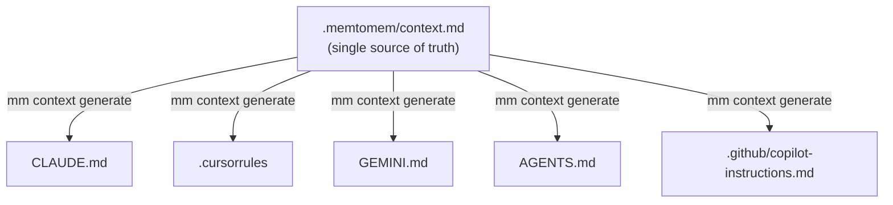
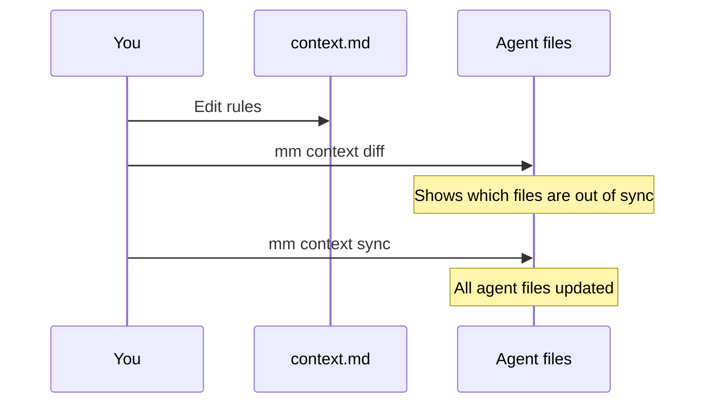
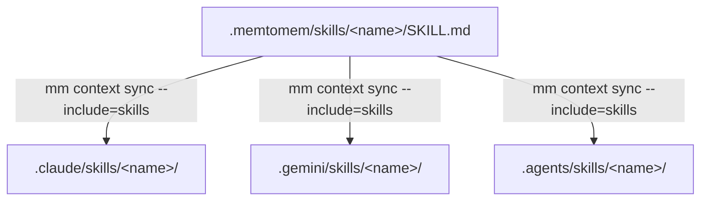
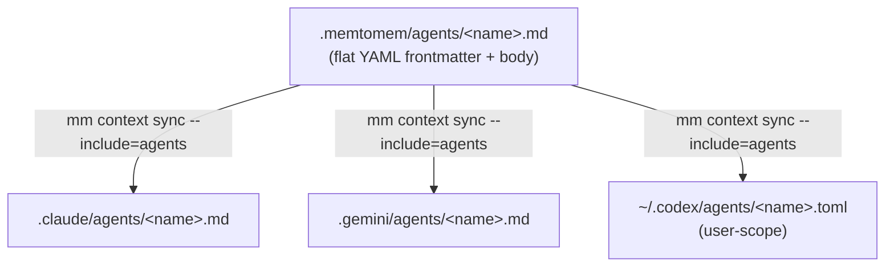
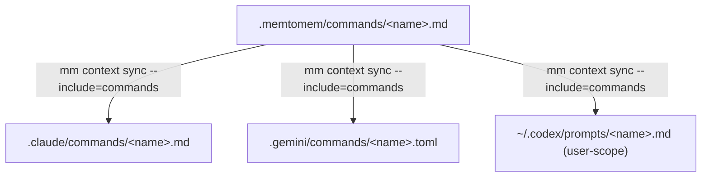

# Agent Context Management — `mm context`

If you use multiple AI editors (Claude Code, Cursor, Gemini CLI, OpenAI Codex, etc.), each expects its own files with overlapping project information — not just project-level instructions (`CLAUDE.md` vs `GEMINI.md` vs `AGENTS.md`), but also **agent skills** (`.claude/skills/` vs `.gemini/skills/` vs `.agents/skills/`) and **sub-agent definitions** (`.claude/agents/*.md` vs `.gemini/agents/*.md` vs `~/.codex/agents/*.toml`). `mm context` keeps all three layers in sync from a single canonical source under `.memtomem/`.

## The problem

```
CLAUDE.md                            ← "Python 3.12+, use ruff, run pytest..."
.cursorrules                         ← same rules (copy-paste)
GEMINI.md                            ← same rules (copy-paste again)

.claude/skills/code-review/SKILL.md  ← identical SKILL.md
.gemini/skills/code-review/SKILL.md  ← identical SKILL.md  (copy-paste)
.agents/skills/code-review/SKILL.md  ← identical SKILL.md  (copy-paste again)

.claude/agents/reviewer.md           ← "You are a code reviewer..."
.gemini/agents/reviewer.md           ← same prompt, slightly different frontmatter
~/.codex/agents/reviewer.toml        ← same prompt, entirely different file format
```

## The solution

memtomem treats `.memtomem/` as the single source of truth for four artifact kinds:

| Artifact | Canonical source | Fan-out target(s) |
|---|---|---|
| Project memory | `.memtomem/context.md` | `CLAUDE.md`, `.cursorrules`, `GEMINI.md`, `AGENTS.md`, `.github/copilot-instructions.md` |
| Agent skills (Phase 1) | `.memtomem/skills/<name>/SKILL.md` | `.claude/skills/`, `.gemini/skills/`, `.agents/skills/` |
| Sub-agents (Phase 2) | `.memtomem/agents/<name>.md` | `.claude/agents/<name>.md`, `.gemini/agents/<name>.md`, `~/.codex/agents/<name>.toml` |
| Slash commands (Phase 3) | `.memtomem/commands/<name>.md` | `.claude/commands/<name>.md`, `.gemini/commands/<name>.toml`, `~/.codex/prompts/<name>.md` |

## Understanding scope

Every fan-out target is either **project-scope** or **user-scope**:

| Scope | Written relative to | Isolation | Example path |
|---|---|---|---|
| **Project** | project root (`.`) | Each project gets its own copy | `.claude/agents/reviewer.md` |
| **User** | home directory (`~`) | Shared across every project on the machine | `~/.codex/agents/reviewer.toml` |

Most targets are project-scope — the generated file lives inside the project tree, is committed to version control, and cannot collide with other projects. The exceptions are:

| User-scope target | Phase | Path |
|---|---|---|
| Codex sub-agents | 2 (Agents) | `~/.codex/agents/<name>.toml` |
| Codex slash commands | 3 (Commands) | `~/.codex/prompts/<name>.md` |
| Claude Code settings | D (Settings) | `~/.claude/settings.json` |

**Cross-project collision warning.** Because user-scope targets live under `~`, running `mm context sync` in two projects that define an agent or command with the same name will overwrite each other silently. This is a limitation of the runtimes' user-scope storage model, not of memtomem. To avoid surprises:

- Use project-specific prefixes for agent/command names when sharing a machine across projects (e.g., `myapp-reviewer` instead of `reviewer`).
- Run `mm context diff --include=agents,commands` after switching projects to check for unexpected overwrites.
- Remember that `mm context init --include=agents` and `mm context init --include=commands` deliberately skip Codex user-scope targets to avoid pulling in artifacts that may belong to a different project.



## Getting started

**If you already have a CLAUDE.md or .cursorrules:**

```bash
mm context init                      # extracts sections from existing files
```

This creates `.memtomem/context.md` with sections parsed from your richest agent file. Review and edit it.

**If starting fresh:**

```bash
mm context init                      # creates a template
```

Edit `.memtomem/context.md` with your project info:

```markdown
## Project
- Name: my-app
- Language: Python 3.12+

## Commands
- Test: pytest
- Lint: ruff check .

## Architecture
FastAPI backend with SQLite storage.

## Rules
- Line length 100
- Type hints required

## Style
- English for code
```

## Generate agent files

```bash
mm context generate --agent all      # generate all
mm context generate --agent claude   # CLAUDE.md only
mm context generate --agent cursor   # .cursorrules only
```

## Keep in sync

When you update project rules:



```bash
# edit .memtomem/context.md
mm context diff                      # see what's out of sync
mm context sync                      # update all detected agent files
```

## Detect existing files

```bash
mm context detect
→ Found 3 agent file(s):
    claude      CLAUDE.md  (4488 bytes)
    cursor      .cursorrules  (1200 bytes)
    gemini      GEMINI.md  (3200 bytes)
```

## Via MCP tools

```
mem_do(action="context_detect")
mem_do(action="context_generate", params={"agent": "cursor"})
mem_do(action="context_diff")
mem_do(action="context_sync")

# Phase 1/2/3 artifact fan-out via the same tools
mem_do(action="context_detect", params={"include": "skills,agents,commands"})
mem_do(action="context_sync",   params={"include": "skills"})
mem_do(action="context_sync",   params={"include": "agents", "strict": True})
mem_do(action="context_sync",   params={"include": "commands"})
mem_do(action="context_diff",   params={"include": "skills,agents,commands"})
```

All four `mem_context_*` tools accept the same `include` parameter (comma-separated, values: `skills`, `agents`, `commands`). `mem_context_generate` and `mem_context_sync` additionally accept `strict=True` to fail on any sub-agent or command field drop.

## Agent-specific sections

Add `## Claude`, `## Cursor`, etc. in context.md for agent-specific overrides:

```markdown
## Rules
- Line length 100 (applies to all agents)

## Claude
- Use tool_handler decorator for all new MCP tools

## Cursor
- Prefer inline type hints over separate .pyi files
```

## Skills fan-out — `--include=skills`

Anthropic released the Agent Skills specification as an open standard in 2025-12, and OpenAI adopted the same `SKILL.md` format for Codex CLI. Today a skill is a directory with a required `SKILL.md` (plus optional `scripts/`, `references/`, `assets/` sub-directories) and the on-disk payload is **byte-identical** across Claude Code, Gemini CLI, and Codex CLI — only the parent directory differs.



```bash
mkdir -p .memtomem/skills/code-review
cat > .memtomem/skills/code-review/SKILL.md <<'EOF'
---
name: code-review
description: Reviews staged changes for quality.
---

Review the staged diff and report issues.
EOF

mm context sync --include=skills
# .claude/skills/code-review/SKILL.md
# .gemini/skills/code-review/SKILL.md
# .agents/skills/code-review/SKILL.md
```

Because the runtime payload is byte-identical, `mm context sync --include=skills` is effectively a 3-way directory mirror — copy plus structural validation. A runtime directory that exists but does **not** contain a `SKILL.md` is treated as hand-written content and left alone; memtomem refuses to clobber it with an `IsADirectoryError` so you can keep other folders next to your skills.

Reverse import:

```bash
mm context init --include=skills             # import existing .claude/skills/ into .memtomem/skills/
mm context init --include=skills --overwrite # also overwrite existing canonical entries
```

Diff status codes: `in sync`, `out of sync`, `missing target`, `missing canonical`.

## Sub-agents fan-out — `--include=agents`

Unlike skills, sub-agent definitions genuinely differ across runtimes. Claude and Gemini both use Markdown + YAML frontmatter but disagree on which fields they support, and Codex uses a TOML schema with a `developer_instructions` key for the system prompt. memtomem parses one canonical Markdown file and emits the correct variant for each runtime, reporting every field it had to drop along the way.



Canonical `.memtomem/agents/code-reviewer.md`:

```markdown
---
name: code-reviewer
description: Reviews staged code for quality
tools: [Read, Grep, Glob]
model: sonnet
skills: [code-review]
isolation: worktree
kind: reviewer
temperature: 0.2
---

You are a meticulous code reviewer.
Respond with a prioritized punch list.
```

| Canonical field | `.claude/agents/*.md` | `.gemini/agents/*.md` | `~/.codex/agents/*.toml` |
|---|---|---|---|
| `name` / `description` | ✓ | ✓ | ✓ |
| body (system prompt) | ✓ | ✓ | → `developer_instructions` |
| `tools` | ✓ | ✓ | **dropped** (Codex models capabilities via `mcp_servers` + `skills.config`) |
| `model` | ✓ | ✓ | ✓ |
| `skills` | ✓ | **dropped** | **dropped** |
| `isolation` | ✓ | **dropped** | **dropped** |
| `kind` | **dropped** | ✓ | **dropped** |
| `temperature` | **dropped** | ✓ | **dropped** |

Running `mm context sync --include=agents` prints every dropped field so you can see exactly what each target lost:

```
  Sub-agent fan-out: 3
    claude_agents    .claude/agents/code-reviewer.md
    gemini_agents    .gemini/agents/code-reviewer.md
    codex_agents     /Users/you/.codex/agents/code-reviewer.toml
  claude_agents dropped ['kind', 'temperature'] from 'code-reviewer'
  gemini_agents dropped ['skills', 'isolation'] from 'code-reviewer'
  codex_agents dropped ['tools', 'skills', 'isolation', 'kind', 'temperature'] from 'code-reviewer'
```

Use `--strict` to promote any drop to an error (fail fast when you require 1:1 fidelity):

```bash
mm context sync --include=agents --strict
# [strict] strict mode: claude_agents would drop ['kind', 'temperature'] from 'code-reviewer'
# Aborted.
```

**Codex sub-agents are user-scope** — they fan out to `~/.codex/agents/` regardless of project. See [Understanding scope](#understanding-scope) for collision implications and mitigation.

Reverse import from runtime files back into canonical (Claude/Gemini only — Codex TOML is deliberately *not* imported because the conversion is lossy and memtomem would have to guess dropped fields):

```bash
mm context init --include=agents
```

Combine skills and agents in one command:

```bash
mm context sync --include=skills,agents
mm context diff --include=skills,agents
```

## Slash commands fan-out — `--include=commands`

Custom slash commands (`/review`, `/fix-issue`, etc.) are the fourth artifact kind. Claude Code, Gemini CLI, and OpenAI Codex CLI all support user-authored commands, but they disagree on the file format: Claude and Codex use Markdown + YAML frontmatter, while Gemini uses TOML. memtomem parses one canonical Markdown file and emits the correct variant for each runtime, rewriting the argument placeholder only where needed (`$ARGUMENTS` ↔ `{{args}}` for Gemini; Codex supports `$ARGUMENTS` natively, so its body is passed through verbatim).



Canonical `.memtomem/commands/review.md`:

```markdown
---
description: Review a file for issues
argument-hint: [file-path]
allowed-tools: [Read, Grep]
model: sonnet
---

Review the file at $ARGUMENTS and report issues.
```

| Canonical field | `.claude/commands/*.md` | `.gemini/commands/*.toml` | `~/.codex/prompts/*.md` |
|---|---|---|---|
| `description` | ✓ | ✓ | ✓ |
| body (prompt) | ✓ (`$ARGUMENTS` preserved) | → `prompt` (rewritten to `{{args}}`) | ✓ (`$ARGUMENTS` / `$1..$9` / `$NAME` / `$$` all native) |
| `argument-hint` | ✓ | **dropped** | ✓ |
| `allowed-tools` | ✓ | **dropped** | **dropped** |
| `model` | ✓ | **dropped** | **dropped** |

Resulting Gemini TOML:

```toml
description = "Review a file for issues"
prompt = "Review the file at {{args}} and report issues."
```

Resulting Codex prompt at `~/.codex/prompts/review.md`:

```markdown
---
description: Review a file for issues
argument-hint: [file-path]
---

Review the file at $ARGUMENTS and report issues.
```

The Gemini side is **lossless in both directions** (only two TOML fields; the `$ARGUMENTS` ↔ `{{args}}` rewrite is reversible), so `mm context init --include=commands` round-trips Gemini TOML back into canonical Markdown. The Codex side is **forward-only** — commands are fanned out to `~/.codex/prompts/` but never imported back, because the user-scope path spans projects and would break the "import runtime files from *this* project" semantic (matching the Phase 2 sub-agent policy for Codex TOML). See [Understanding scope](#understanding-scope) for more on user-scope targets and cross-project collision.

Running sync prints every dropped field so you can see what each runtime lost:

```
  Command fan-out: 3
    claude_commands    .claude/commands/review.md
    gemini_commands    .gemini/commands/review.toml
    codex_commands     ~/.codex/prompts/review.md
  gemini_commands dropped ['argument-hint', 'allowed-tools', 'model'] from 'review'
  codex_commands dropped ['allowed-tools', 'model'] from 'review'
```

Use `--strict` to fail on any drop:

```bash
mm context sync --include=commands --strict
# [strict] strict mode: gemini_commands would drop [...] from 'review'
# Aborted.
```

> **Codex custom prompts are upstream-deprecated.** OpenAI's docs recommend migrating reusable command-like workflows to **skills** (which memtomem already fans out to Codex via `.agents/skills/` in Phase 1). memtomem still syncs canonical commands to `~/.codex/prompts/` for parity with Claude + Gemini, but for new authoring you should prefer a skill. Reverse import from `~/.codex/prompts/` is intentionally not supported — author under `.memtomem/commands/` and let fan-out populate Codex.

Combine every artifact kind in a single command:

```bash
mm context sync --include=skills,agents,commands
mm context diff --include=skills,agents,commands
```

## Supported targets

| Runtime | Project memory | Skills | Sub-agents | Commands | Settings |
|---|---|---|---|---|---|
| Claude Code | `CLAUDE.md` | `.claude/skills/` | `.claude/agents/*.md` | `.claude/commands/*.md` | `~/.claude/settings.json` **U** |
| Cursor | `.cursorrules` | — | — | — | — |
| Gemini CLI | `GEMINI.md` | `.gemini/skills/` | `.gemini/agents/*.md` (experimental) | `.gemini/commands/*.toml` | — |
| OpenAI Codex CLI | `AGENTS.md` | `.agents/skills/` | `~/.codex/agents/*.toml` **U** | `~/.codex/prompts/*.md` **U** | — |
| GitHub Copilot | `.github/copilot-instructions.md` | — | — | — | — |

**U** = user-scope (written to `~`, shared across projects). All other targets are project-scope. See [Understanding scope](#understanding-scope) for implications.

---

## Settings Hooks Integration (Phase D)

memtomem can manage Claude Code hooks via a canonical
`.memtomem/settings.json` file.  The `--include=settings` flag on
`mm context generate/sync/diff` merges your hooks into
`~/.claude/settings.json` additively.

### Quick start

```bash
# 1. Create the canonical source (or let mm init create it)
mkdir -p .memtomem
echo '{"hooks": {}}' > .memtomem/settings.json

# 2. Add your hooks to .memtomem/settings.json, then sync
mm context sync --include=settings

# 3. Check sync status
mm context diff --include=settings
```

### Merge rules

- **Additive-only**: hooks are appended to the target, never overwritten.
- **Name-based conflict detection**: if a hook with the same `name` already
  exists in `~/.claude/settings.json`, memtomem skips it and emits a warning
  with a concrete remediation step.
- **User wins**: on conflict, your existing hook is preserved verbatim.
- **`mm context diff --include=settings`** shows the merge plan without
  writing (dry-run).

### Caveats

- **Formatting is not preserved.**  After `mm context sync --include=settings`,
  `~/.claude/settings.json` is normalized to `json.dumps(indent=2)`.  If you
  hand-edit the file with custom indentation or key order, expect the layout
  to change on sync.
- **Malformed JSON is skipped.**  If `~/.claude/settings.json` is not valid
  JSON, the sync reports an error and does **not** modify the file.  Fix it
  manually, then re-run the sync.
- **Claude Code must be installed.**  If `~/.claude/` does not exist, the
  settings runtime is silently skipped.  memtomem never creates `~/.claude/`.
- **Concurrent writes.**  A basic mtime guard detects if another process
  modifies `~/.claude/settings.json` during the merge and aborts rather than
  overwriting.  Re-run the sync to retry.

### MCP usage

The same functionality is available through MCP tools:

```
mem_context_generate(include="settings")
mem_context_sync(include="settings")
mem_context_diff(include="settings")
mem_context_detect(include="settings")
```

---

## Next Steps

- [User Guide](user-guide.md) — Complete feature walkthrough
- [Getting Started](getting-started.md) — Install and setup wizard
- [Hooks](hooks.md) — Claude Code hook automation recipes
