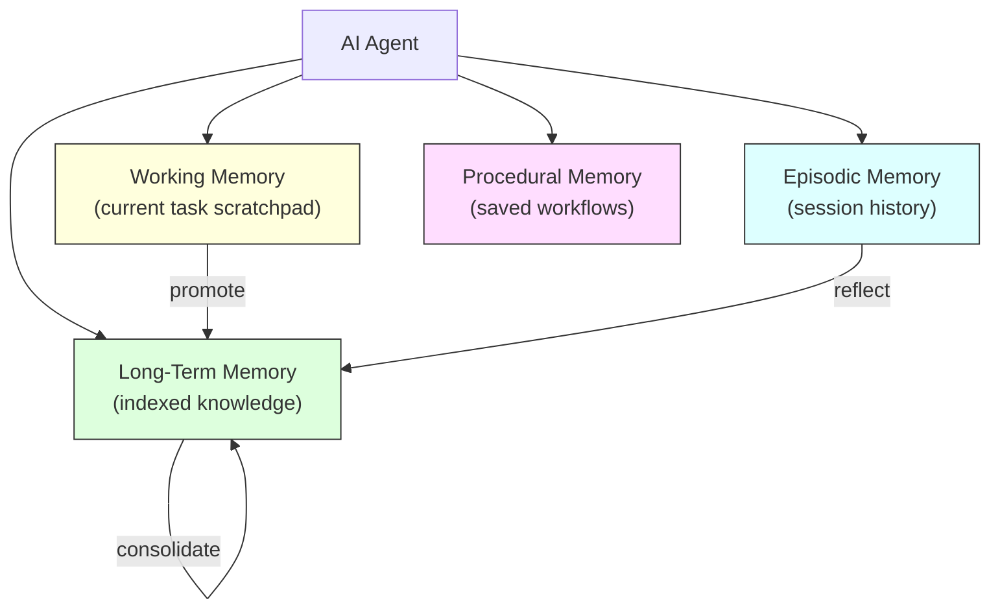
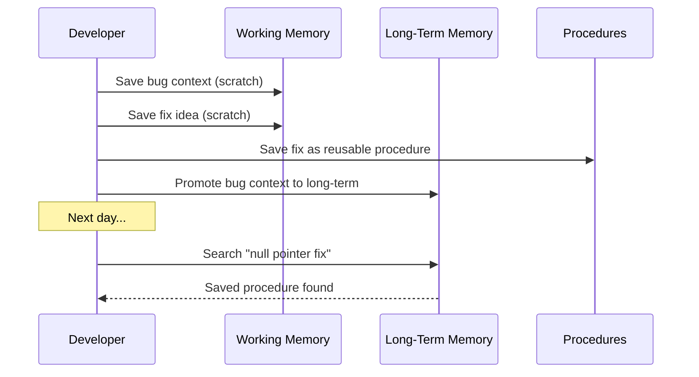
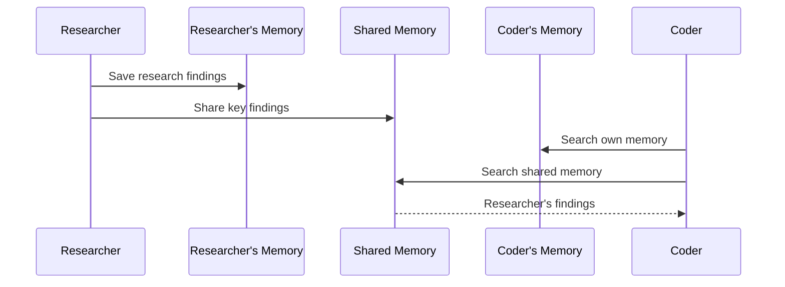
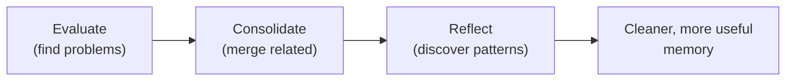

# Agent Memory Harness Guide

**Audience**: Users who want their AI agent to remember across sessions
**Prerequisites**: [Getting Started](getting-started.md) complete, memtomem connected
**Difficulty**: Intermediate — you don't need this for basic search/add. Read this when you want sessions, scratchpads, or reusable workflows.

> **New to memtomem?** Start with [Getting Started](getting-started.md) and [Hands-On Tutorial](hands-on-tutorial.md) first. This guide covers advanced memory patterns.

---

## What are "memory types"?

Think of how your own memory works:

| Memory type | Human analogy | memtomem equivalent |
|-------------|---------------|---------------------|
| **Long-Term** | Notes you've written down | `mem_search`, `mem_add`, `mem_index` — your indexed files |
| **Working** | Sticky notes on your desk during a task | `mem_scratch_set/get` — temporary, deleted after session |
| **Episodic** | "Last Tuesday I debugged the auth bug" | `mem_session_*` — session history with timestamps |
| **Procedural** | "Here's how I deploy to production" | `mem_procedure_save/list` — reusable step-by-step workflows |

**You already have Long-Term Memory** if you've done the Getting Started guide. The other types are optional and useful for more advanced workflows.

---

## Overview

AI agents forget everything between sessions. memtomem gives them memory that persists, organized like how humans remember:



| Capability | Why it matters | Tools |
|------------|---------------|-------|
| **Episodic Memory** | Know what happened in previous sessions | `mem_session_*` |
| **Working Memory** | Hold temporary context during a task without polluting long-term memory | `mem_scratch_*` |
| **Procedural Memory** | Reuse successful workflows instead of re-inventing them | `mem_procedure_*` |
| **Multi-Agent Memory** | Let agents share knowledge without stepping on each other | `mem_agent_*` |
| **Consolidation** | Summarize scattered notes into coherent knowledge | `mem_consolidate*` |
| **Reflection** | Discover patterns and gaps in what the agent knows | `mem_reflect*` |
| **Evaluation** | Monitor memory health (stale data, missing tags, unused memories) | `mem_eval` |

---

## Scenario 1: Developer's Daily Workflow

A developer debugging a bug, saving the fix as a procedure for future reuse.



### Session Start

Sessions, scratch, procedures and the other advanced actions used in
this guide are **non-core** — in the default `MEMTOMEM_TOOL_MODE=core`
they are routed through `mem_do(action="...", params={...})`. If you
set `MEMTOMEM_TOOL_MODE=standard` or `full` (see the
[Tool Mode Configuration](#tool-mode-configuration) section below)
you can call them as top-level tools named `mem_<action>` instead.

```
> mem_do(
    action="session_start",
    params={"agent_id": "developer", "title": "Bug fix: auth timeout"}
  )
→ Session started: a1b2c3d4-...
- Title: Bug fix: auth timeout
- Agent: developer
- Namespace: default
```

The optional `title` parameter gives the session a human-readable name that appears in `session_list`.

### Working Memory During Debug

```
> mem_do(
    action="scratch_set",
    params={"key": "bug_context", "value": "UserService.login() throws NPE when email is null"}
  )
→ Stored: bug_context [session: a1b2c3d4...]

> mem_do(
    action="scratch_set",
    params={"key": "fix_idea", "value": "Add null check before email.toLowerCase()"}
  )
→ Stored: fix_idea [session: a1b2c3d4...]

> mem_do(action="scratch_get")
→ Working memory: 2 entries

  bug_context: UserService.login() throws NPE when email is nul...
  fix_idea: Add null check before email.toLowerCase()...
```

### Save Fix as Procedure

```
> mem_do(
    action="procedure_save",
    params={
      "name": "NPE Fix Pattern",
      "steps": "1. Check input params for null\n2. Add @NonNull annotation\n3. Write unit test for null case",
      "trigger": "NPE in service layer",
      "tags": ["java", "debugging"]
    }
  )
→ Memory added to ~/.memtomem/memories/procedures/npe-fix-pattern.md
- Chunks indexed: 1
- File: ~/.memtomem/memories/procedures/npe-fix-pattern.md
```

### Promote Working Memory to Long-Term

```
> mem_do(
    action="scratch_promote",
    params={"key": "bug_context", "title": "Login NPE Root Cause", "tags": ["bugfix", "java"]}
  )
→ Promoted 'bug_context' to long-term memory.
Memory added to ~/.memtomem/memories/2026-04-11.md
- Chunks indexed: 1
- File: ~/.memtomem/memories/2026-04-11.md
```

### Session End

```
> mem_do(
    action="session_end",
    params={"summary": "Fixed login NPE, saved fix procedure"}
  )
→ Session ended: a1b2c3d4-...
- Events: 4 (query:2, add:2)
- Summary: Fixed login NPE, saved fix procedure...
- Working memory cleaned: 1 entries
```

### Next Day — Retrieve Procedure

```
> mem_search(query="null pointer exception fix", source_filter="procedures")
→ [1] Procedure: NPE Fix Pattern (score: 0.85)
  Trigger: NPE in service layer
  Steps: 1. Check input params...
```

---

## Scenario 2: Multi-Agent Team Collaboration

A research agent and a coding agent sharing knowledge through namespaced memory.



### Register Agents

```
> mem_do(
    action="agent_register",
    params={"agent_id": "researcher", "description": "Research and analysis agent"}
  )
→ Agent registered: researcher
- Namespace: agent/researcher
- Shared namespace: shared
Use namespace='agent/researcher' for agent-specific memories,
or namespace='shared' for cross-agent knowledge.

> mem_do(
    action="agent_register",
    params={"agent_id": "coder", "description": "Code implementation agent"}
  )
→ Agent registered: coder
- Namespace: agent/coder
- Shared namespace: shared
Use namespace='agent/coder' for agent-specific memories,
or namespace='shared' for cross-agent knowledge.
```

### Researcher Saves Findings

`mem_add` is a core tool, so you can call it directly even in `core`
mode:

```
> mem_add(
    content="GraphQL federation allows composing multiple subgraphs. Apollo Gateway handles schema stitching.",
    title="GraphQL Federation Research",
    tags=["graphql", "architecture"],
    namespace="agent/researcher"
  )
→ Memory added to ~/.memtomem/memories/2026-04-11.md
- Chunks indexed: 1
- File: ~/.memtomem/memories/2026-04-11.md
```

### Share to Team

```
> mem_do(
    action="agent_share",
    params={"chunk_id": "abc123...", "target": "shared"}
  )
→ Shared to namespace 'shared'.
Memory added to ~/.memtomem/memories/2026-04-11.md
- Chunks indexed: 1
- File: ~/.memtomem/memories/2026-04-11.md
```

### Coder Searches Shared + Own Scope

```
> mem_do(
    action="agent_search",
    params={"query": "GraphQL architecture", "agent_id": "coder", "include_shared": true}
  )
→ [1] GraphQL federation allows composing... (shared)
  [2] Apollo Gateway handles schema... (agent/researcher)
```

---

## Scenario 3: Memory Quality Management

Over time, memories accumulate and become noisy. These tools help keep your knowledge base healthy.



### Health Check

```
> mem_do(action="eval")
→ ## Memory Health Report

### Index Stats
- Total chunks: 384
- Total sources: 114

### Access Coverage
- Never accessed: 371/384 (97%)
- Accessed at least once: 13/384 (3%)

### Tag Coverage
- Tagged: 15/384 (4%)
- Untagged: 369/384 (96%)

### Namespace Distribution
  default: 380 chunks
  agent/researcher: 2 chunks
  shared: 2 chunks
```

### Find Consolidation Candidates

```
> mem_do(action="consolidate", params={"min_group_size": 3})
→ Consolidation candidates: 5 groups

### Group 0: user-guide.md
  Chunks: 16, ~5800 tokens
    - [abc123de] Quick Start Guide...
    - [def456ab] Configuration section...
  → Use mem_consolidate_apply(group_id=0, summary='...')
```

### Apply Consolidation (Agent Writes Summary)

```
> mem_do(
    action="consolidate_apply",
    params={
      "group_id": 0,
      "summary": "User guide covers: quick start (ollama + MCP setup), search/add/index workflows, namespace management, Google Drive multi-device setup, and Web UI dashboard."
    }
  )
→ Consolidation applied for group 0.
Memory added to ~/.memtomem/memories/2026-04-12.md
- Chunks indexed: 1
- File: ~/.memtomem/memories/2026-04-12.md
- Summary chunk id: 7f3a2b1c-9e8d-4f5a-a1b2-c3d4e5f6a7b8
- Originals linked: 16/16
- Originals kept: True
```

The summary is appended to the first configured `memory_dirs` (daily notes
file by default) so it shows up in filesystem browsing, rsync backups, and
git-tracked memory vaults. Each original chunk is linked to the new summary
chunk via a `consolidated_into` relation, so `mem_related` / `mem_expand`
can walk back to the originals whenever needed.

### Automate Consolidation via Policy

Manual `mem_consolidate` / `mem_consolidate_apply` is ideal when you want
LLM-quality summaries that the agent writes itself. For unattended
background consolidation, register an `auto_consolidate` policy instead —
it produces a deterministic heuristic summary per source file and runs on
demand through `mem_policy_run`:

```
> mem_do(
    action="policy_add",
    params={
      "name": "weekly-consolidate",
      "policy_type": "auto_consolidate",
      "config": "{\"min_group_size\": 5, \"max_groups\": 10, \"keep_originals\": true}"
    }
  )
→ Policy 'weekly-consolidate' created (type=auto_consolidate, id=1)

> mem_do(action="policy_run", params={"name": "weekly-consolidate", "dry_run": true})
→ [DRY RUN] Would consolidate 3 groups: meeting-notes.md, daily-2026-04-10.md, project-roadmap.md
```

Key differences between the two paths:

| Aspect               | `mem_consolidate_apply` (agent) | `auto_consolidate` policy |
|----------------------|---------------------------------|---------------------------|
| Summary quality      | LLM-written (agent supplies)    | Deterministic heuristic (keyword-boosted bullets) |
| Storage              | Real markdown file in `memory_dirs` | Virtual chunk (no file on disk) |
| Namespace            | Same as originals               | `archive:summary` (hidden from default search, see below) |
| Idempotency          | Agent decides when to run       | Source hash comparison + `consolidated_into` check |
| Best for             | High-value knowledge merges     | Bulk decluttering, recurring scans |

Policy-driven summaries land in the `archive:summary` namespace and are
**excluded from default search** by the `search.system_namespace_prefixes`
config (defaults to `["archive:"]`). They stay retrievable via
`mem_search(..., namespace="archive:summary")`, `mem_related`, and
`mem_expand` — the consolidation audit trail is preserved without
cluttering day-to-day results. If you prefer archived content to remain
searchable by default, set `search.system_namespace_prefixes = []`.

### Reflect on Patterns

```
> mem_do(action="reflect")
→ ## Memory Reflection Report

### Frequently Accessed Topics
  10x — deployment steps
  6x — GraphQL architecture

### Recurring Themes (by tag)
  procedure: 3 chunks
  architecture: 2 chunks

### Knowledge Gaps (frequent queries with no results)
  3x — "kubernetes pod debugging"
  2x — "Redis cluster configuration"

---
Use `mem_reflect_save` to record insights derived from this report.
```

### Save Insight

```
> mem_do(
    action="reflect_save",
    params={
      "insight": "Deployment and architecture decisions are the most frequently accessed topics. Knowledge gaps exist in Kubernetes and Redis areas — consider adding documentation.",
      "tags": ["strategy"]
    }
  )
→ Insight saved.
Memory added to ~/.memtomem/memories/reflections.md
- Chunks indexed: 1
- File: ~/.memtomem/memories/reflections.md
```

---

## Scenario 4: Search Quality Tuning

Fine-tuning search behavior with per-query weight adjustment.

### Default Search (Equal BM25 + Dense)

```
> mem_search(query="deployment automation", top_k=3)
→ [1] score=0.0328 | CI/CD pipeline configuration...
```

### Keyword-Heavy Search (BM25 Boosted)

When you need exact keyword matches (e.g., error messages, config keys):

```
> mem_search(query="MEMTOMEM_EMBEDDING__DIMENSION", bm25_weight=3.0, dense_weight=0.5)
→ [1] score=0.0984 | Configuration section with exact variable name...
```

### Semantic-Heavy Search (Dense Boosted)

When you need conceptual matches (e.g., "how does X work"):

```
> mem_search(query="how does the search pipeline combine results", bm25_weight=0.5, dense_weight=3.0)
→ [1] score=0.0984 | Reciprocal Rank Fusion merges BM25 and dense...
```

---

## Scenario 5: Structured Templates

Using built-in templates for consistent knowledge capture.

### Architecture Decision Record

```
> mem_add(
    template="adr",
    content='{"title": "Use PostgreSQL", "status": "accepted", "context": "Need ACID for financial data", "decision": "PostgreSQL with pgvector", "consequences": "Team training needed"}'
  )
→ Memory added to ~/.memtomem/memories/2026-04-11.md
- Chunks indexed: 1
- File: ~/.memtomem/memories/2026-04-11.md
```

Contents appended to the target file:
```markdown
## ADR: Use PostgreSQL
**Status**: accepted
**Context**: Need ACID for financial data
**Decision**: PostgreSQL with pgvector
**Consequences**: Team training needed
```

### Meeting Notes

```
> mem_add(
    template="meeting",
    content='{"title": "Sprint Planning", "attendees": "Alice, Bob", "agenda": "Q2 roadmap", "decisions": "Prioritize auth module", "action_items": "Bob: JWT by Friday"}'
  )
→ Memory added to ~/.memtomem/memories/2026-04-11.md
- Chunks indexed: 1
- File: ~/.memtomem/memories/2026-04-11.md
```

The `meeting` template auto-fills `date` to today when the field is omitted from the JSON payload.

### Debug Log (Plain Text)

```
> mem_add(
    template="debug",
    content="Server returned 500 on /api/users after deploying v2.3"
  )
→ Memory added to ~/.memtomem/memories/2026-04-11.md
- Chunks indexed: 1
- File: ~/.memtomem/memories/2026-04-11.md
```

When a plain string (not JSON) is passed to a template, memtomem fills the template's primary field (e.g. `symptom` for `debug`) with the string and marks the other fields as `(fill: ...)` placeholders in the rendered markdown.

### Available Templates

| Template | Fields | Auto-fills |
|----------|--------|------------|
| `adr` | title, status, context, decision, consequences | status → "proposed" |
| `meeting` | title, date, attendees, agenda, decisions, action_items | date → today |
| `debug` | title, symptom, root_cause, fix, prevention | — |
| `decision` | title, options, chosen, rationale | — |
| `procedure` | title, trigger, steps, tags | — |

---

## Scenario 6: URL Fetching and Indexing

Index external web pages as searchable memory.

```
> mem_do(
    action="fetch",
    params={"url": "https://docs.example.com/api/authentication", "tags": ["reference", "api"]}
  )
→ Fetched and indexed: https://docs.example.com/api/authentication
- Saved to: ~/.memtomem/memories/_fetched/docs-example-com-api-authentication.md
- Chunks indexed: 3

> mem_search(query="API authentication bearer token")
→ [1] score=0.85 | docs-example-com-api-authentication.md
  Use **Bearer tokens** for API authentication...
```

HTML is automatically converted to markdown. Script/style/nav/footer elements are removed.

---

## Tool Mode Configuration

Control how many tools are exposed to the AI agent:

```json
"env": { "MEMTOMEM_TOOL_MODE": "standard" }
```

| Mode | Tools | Recommended For |
|------|-------|-----------------|
| `core` (default) | 9 (8 core + `mem_do`) | Simple search + add workflows; `mem_do` routes to all other actions |
| `standard` | ~30 + `mem_do` | Normal use with editing, tags, sessions, procedures |
| `full` | 74 (all tools) | Full harness including consolidation, reflection, evaluation |

Web UI and CLI always have full access regardless of tool mode.

---

## Next Steps

- [User Guide](user-guide.md) — Core features walkthrough
- [Use Cases](use-cases.md) — Basic MCP tool workflows
- [Claude Code Integration](integrations/claude-code.md) — Plugin and hooks setup
