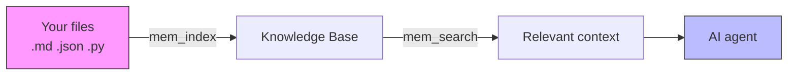
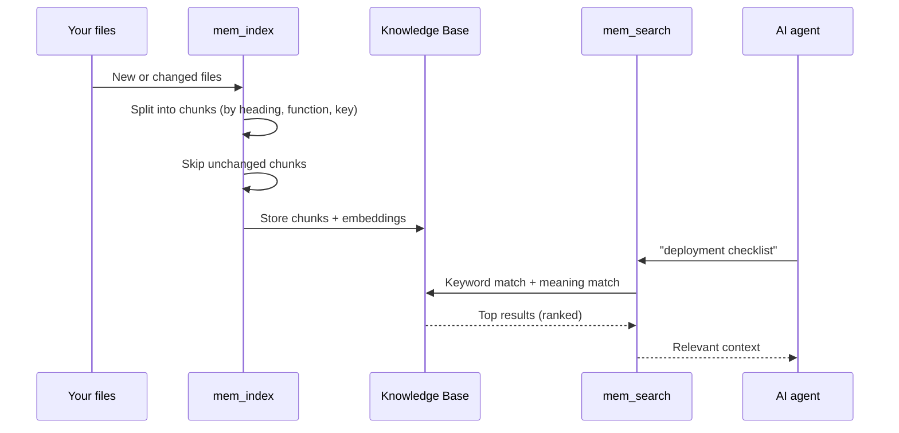
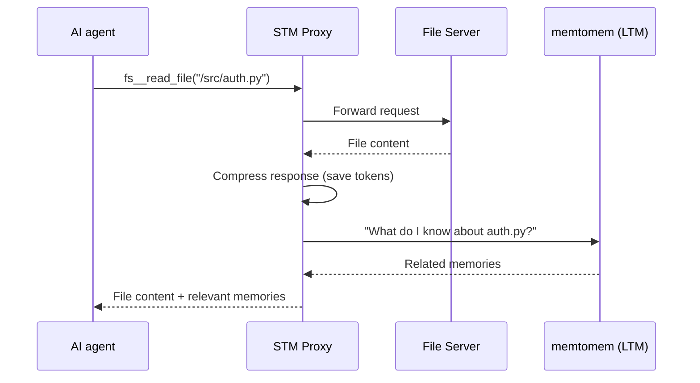

# memtomem Reference

**Audience**: Users who have completed the [Getting Started](getting-started.md) guide
**Prerequisites**: memtomem installed, MCP server connected to your AI editor

> **New to memtomem?** Start with [Getting Started](getting-started.md) first. This guide is a complete reference for all features.

---

## Glossary

| Term | Meaning |
|------|---------|
| **MCP** | Model Context Protocol — how your AI editor talks to memtomem |
| **Embedding** | A numeric vector that represents the meaning of text |
| **BM25** | Keyword-based search algorithm (like Google, but local) |
| **Dense search** | Meaning-based search using embeddings |
| **Hybrid search** | BM25 + dense combined — the default in memtomem |
| **RRF** | Reciprocal Rank Fusion — the algorithm that merges keyword and meaning results |
| **Chunk** | A section of a file (one heading, one function, one key) — the unit of indexing |
| **Namespace** | A label to organize memories (e.g., "work", "personal", "project-x") |
| **`mem_do`** | Meta-tool that routes to all non-core actions (with aliases). Use `mem_do(action="help")` to list all |

---

## How memtomem Works



**Index once, search forever.** memtomem reads your files, breaks them into meaningful chunks, and builds a searchable index. When your AI agent needs context, it searches by both keywords and meaning to find the most relevant pieces.

Your `.md` files are the source of truth. The index is a rebuildable cache — delete it anytime and re-index.

### What happens under the hood



---

## MCP Tools at a Glance

memtomem provides **86 MCP tools** organized into categories:

| Category | Tools | What they do |
|----------|-------|-------------|
| **Search** | `mem_search`, `mem_recall` | Find memories by meaning or by date |
| **CRUD** | `mem_add`, `mem_batch_add`, `mem_edit`, `mem_delete` | Create, update, remove memories |
| **Indexing** | `mem_index` | Build the knowledge base from files |
| **Namespace** | `mem_ns_list/set/get/assign/update/rename/delete` | Organize memories into groups |
| **Maintenance** | `mem_dedup_scan/merge`, `mem_decay_scan/expire`, `mem_auto_tag` | Keep the index clean |
| **Data** | `mem_export`, `mem_import` | Backup and restore |
| **Ask** | `mem_ask` | Natural-language Q&A over indexed memories (requires LLM) |
| **Health** | `mem_watchdog`, `mem_cleanup_orphans` | System health checks and orphan cleanup |
| **Relations** | `mem_link`, `mem_unlink`, `mem_related` | Cross-reference links between chunks |
| **Working Memory** | `mem_scratch_set/get/promote` | Ephemeral key-value scratch space |
| **Config** | `mem_stats`, `mem_status`, `mem_config`\*, `mem_embedding_reset`\*, `mem_reset`\* | Monitor and configure |

\* Requires `MEMTOMEM_TOOL_MODE=full`. In `core` or `standard` mode, use `mm config` (CLI) or the Web UI Settings tab instead.

### `mem_do` action naming convention

In **core** tool mode (default), most features are accessed through `mem_do(action="...")`. Action names follow these conventions:

- **Namespace actions** use `ns_` prefix: `ns_list`, `ns_set`, `ns_assign`, `ns_rename`, `ns_delete`
- **Session actions** use `session_` prefix: `session_start`, `session_end`, `session_list`
- **Scratch (working memory)** uses `scratch_` prefix: `scratch_set`, `scratch_get`, `scratch_promote`
- **Maintenance** uses descriptive names: `dedup_scan`, `decay_expire`, `cleanup_orphans`
- **Analytics** uses short names: `eval`, `activity`, `timeline`, `reflect`

Use `mem_do(action="help")` to see all available actions, or `mem_do(action="help", params={"category": "sessions"})` for per-category details with parameter descriptions. Common aliases are supported (e.g. `health_report` → `eval`, `namespace_set` → `ns_set`).

---

## 1. Indexing — `mem_index`

### Index a directory

```
mem_index(path="~/notes")
→ Indexing complete:
  - Files scanned: 47
  - Total chunks: 312
  - Indexed: 312
  - Skipped (unchanged): 0
  - Deleted (stale): 0
  - Duration: 2340ms
```

Supported files and their chunking strategies:

| File Type | Strategy |
|-----------|----------|
| `.md` | Heading-aware split (`#`, `##`, `###`) |
| `.json` / `.yaml` / `.toml` | Top-level key split |
| `.py` | Functions and classes (tree-sitter) |
| `.js` / `.ts` / `.tsx` | Functions and classes (tree-sitter) |

### Incremental re-indexing

memtomem tracks what changed via a SHA-256 hash per chunk. A second
call on the same path only re-embeds chunks whose hash is new:

```
mem_index(path="~/notes")
→ Indexing complete:
  - Files scanned: 47
  - Total chunks: 315
  - Indexed: 5
  - Skipped (unchanged): 308
  - Deleted (stale): 2
  - Duration: 180ms
```

How to read the stats:

- **Indexed** — chunks whose content hash is new (brand-new sections
  *or* edited sections whose hash changed). Only these hit the embedder.
- **Skipped (unchanged)** — hash matched an existing chunk, no
  embedding call made.
- **Deleted (stale)** — chunks that used to exist in a file but are no
  longer produced. An edited section contributes to **both**
  `Indexed` (new hash) and `Deleted (stale)` (old hash), because the
  diff is hash-based, not UUID-based.

### Force re-index

After switching embedding models, upgrading memtomem, or for a clean
rebuild, pass `force=True` — every chunk is re-embedded regardless of
hash match, so they all show up under `Indexed`:

```
mem_index(path="~/notes", force=True)
```

**Chunk identity is preserved when content is unchanged.** As of v0.1.33
([ADR-0005](../adr/0005-force-reindex-metadata-contract.md)), force-reindex
keeps the existing `id` (UUID), `access_count`, `last_accessed_at`,
`importance_score`, and `chunk_links` rows for any chunk whose content
hash still matches what the file produces. Only embeddings are
recomputed. This means agents that cache chunk IDs, scheduled
re-embedding jobs, and personalization signals all survive a force
rebuild — previously every force pass regenerated UUIDs and silently
zeroed access stats.

### Namespace-scoped indexing

```
mem_index(path="~/work/docs", namespace="work")
mem_index(path="~/personal/notes", namespace="personal")
```

### Auto-watch vs manual seed

`MEMTOMEM_INDEXING__MEMORY_DIRS` feeds a file watcher that runs inside
the `mm server` (MCP) process. The watcher is **reactive only** — it
reindexes files when the filesystem emits modify / create / move events.
Two cases it does NOT cover:

- **Pre-existing files on disk** when you first configure a `memory_dir`.
  Run `mm index <dir>` (or `mem_index(path="<dir>")`) once to seed them;
  after that, the watcher picks up further edits.
- **Files outside `memory_dirs`.** Call `mem_index` / `mm index` manually
  with the path you want indexed ad-hoc.

Both are idempotent — chunks are content-hashed, so unchanged files are
skipped on re-runs. This is why the `mm init` wizard's `Next steps` lists
`mm index {memory_dir}` as step 1.

### Hook integration — debounce queue

For editor / hook callers (PostToolUse[Write] in Claude Code, etc.) that
fire on every save, `mm index` ships three mutually-exclusive flags that
share a small on-disk queue at `~/.memtomem/index_debounce_queue.json`:

```bash
mm index --debounce-window 5 PATH   # record PATH; drain entries silent ≥5s
mm index --flush                    # synchronously drain everything queued
mm index --status                   # snapshot queue depth + oldest entry
```

- `--debounce-window <SECONDS>` records the path and re-indexes only
  entries that have been silent for at least `SECONDS`. Rapid consecutive
  writes restart the window so a burst is indexed once at the end.
- `--flush` blocks until every queued file has been indexed (or recorded
  as an error). Use this when correctness matters — e.g. a `Stop` hook
  draining before session end. Worst-case latency ≈ queue depth ×
  per-file index cost.
- `--status` is informational only. Concurrent hooks may modify the
  queue between this read and any later action; for correctness use
  `--flush`, not status-then-flush.

All three accept `--json` for one-line scripted output.

---

## 2. Search — `mem_search`, `mem_recall`

### `mem_search` — Hybrid search

```
mem_search(query="deployment checklist")
```

Combines keyword matching (exact words) with meaning-based search (similar concepts), then merges the results for the best of both worlds.

**Parameters**:

| Parameter | Description | Example |
|-----------|-------------|---------|
| `query` | Natural language search query | `"authentication flow"` |
| `top_k` | Number of results (default 10, max 100) | `20` |
| `source_filter` | File path substring (recommended) or glob | `"docs/adr"`, `".yaml"` |
| `tag_filter` | Comma-separated tags, OR logic | `"redis,cache"` |
| `namespace` | Scope to namespace | `"work"` |
| `as_of` | Temporal validity query — only return chunks valid on this date (default = current time). Date-only `YYYY-MM-DD` or quarter `YYYY-QN`. Chunks without `valid_from`/`valid_to` frontmatter are always-valid and unaffected. | `"2024-Q3"` |
| `bm25_weight` / `dense_weight` | Override RRF weights (default `1.0`) | `2.0` |
| `context_window` | Expand each result with ±N adjacent chunks (`0` = disabled) | `1` |
| `output_format` | `"compact"` (default), `"verbose"`, or `"structured"` (JSON with `hints` field) | `"structured"` |

```
mem_search(query="caching strategy", tag_filter="redis,cache", namespace="work")
mem_search(query="auth", source_filter="docs/adr", top_k=5)
mem_search(query="deploy pipeline", as_of="2025-Q3")    # historical query
```

> **Result count with filters**: `mem_search` returns *up to* `top_k` results. Post-rerank filters (`source_filter`, `tag_filter`, `as_of` validity) reduce the returned count one-for-one when they exclude candidates. Increase `top_k` or `rerank_pool` to widen the pre-filter candidate set; this method does not auto-oversample.

> **source_filter tip**: Use substrings like `"docs/adr"` or `".py"` for filtering. Glob patterns (`*`, `?`) are matched against the **full absolute path** via `fnmatch`, so `"*.py"` won't work as expected — use `".py"` instead.

> **Trust-UX hints**: when you don't pin a namespace, results are followed by a parenthesized hint if chunks were hidden in system namespaces (e.g. `archive:*`) or if the configured embedding dimension disagrees with what's in the database. In `output_format="structured"` those hints are emitted as a `hints` array instead.

### Tuning search weights

Use `bm25_weight` and `dense_weight` to shift between keyword and semantic matching:

```
mem_search(query="쿠버네티스", bm25_weight=2.0, dense_weight=0.5)   # keyword-heavy
mem_search(query="container alerts", bm25_weight=0.5, dense_weight=2.0) # meaning-heavy
```

### Cross-language search

memtomem supports searching across languages (e.g., querying in English to find Korean content), but quality depends on the embedding model:

#### Embedding model choice

| Model | KR→EN cross-search | EN→KR cross-search | KR semantic accuracy |
|-------|:---:|:---:|:---:|
| `nomic-embed-text` (768d) | Weak (often misses) | Good (#2) | Moderate |
| `bge-m3` (1024d) | **Good (#2)** | **Good (#2)** | **High (#1)** |

**Recommendation**: Use `bge-m3` if you work with Korean or other non-English content. Switch with:
```
mm embedding-reset --mode apply-current   # after updating config
mm index ~/notes --force                  # re-embed all files
```

Or in `~/.memtomem/config.json`:
```json
{"embedding": {"model": "bge-m3", "dimension": 1024}}
```

#### BM25 and language

- **Keyword (BM25) search** is language-bound — Korean keywords only match Korean text, English keywords only match English text. This is expected.
- For **Korean-heavy workloads**, switch the tokenizer to `kiwipiepy` for better BM25 results:
  ```
  mm config set search.tokenizer kiwipiepy
  ```
  This requires `pip install kiwipiepy` and provides morphological analysis for Korean text. The default `unicode61` tokenizer splits Korean text at character boundaries rather than morpheme boundaries.

### `mem_recall` — Date-range retrieval

Find memories by *when* they were created, without a search query:

```
mem_recall(since="2026-03", limit=10)
mem_recall(since="2026-01", until="2026-03")
mem_recall(since="2026-03-15", source_filter="meeting*")
mem_recall(namespace="project:*", limit=5)
```

**Parameters**:

| Parameter | Description | Format |
|-----------|-------------|--------|
| `since` | Inclusive start date | `YYYY`, `YYYY-MM`, `YYYY-MM-DD`, ISO datetime |
| `until` | Exclusive end date | same formats |
| `source_filter` | File path substring or glob | `"notes"`, `"*.md"` |
| `namespace` | Single, comma-separated, or glob | `"work"`, `"project:*"` |
| `limit` | Max results (default 20, max 500) | `10` |
| `output_format` | `"compact"` (default) or `"structured"` (JSON with `hints` field) | `"structured"` |

Like `mem_search`, `mem_recall` hides system namespaces (`archive:*` by default) when no namespace is pinned and appends a trust-UX hint if any chunks were filtered or if an embedding dimension mismatch is detected. `output_format="structured"` exposes those as a `hints` array for programmatic consumers.

---

## 3. Memory CRUD — `mem_add`, `mem_batch_add`, `mem_edit`, `mem_delete`

### `mem_add` — Add a note

```
mem_add(content="Redis LRU→LFU migration reduced cache misses by 40%", tags="redis,performance")
→ Saved to ~/.memtomem/memories/2026-03-30.md (1 chunk indexed)
```

| Parameter | Description |
|-----------|-------------|
| `content` | The note text |
| `title` | Optional heading (becomes `## title` in the file) |
| `tags` | Comma-separated tags |
| `file` | Target file path (auto-generates date-stamped file if omitted) |
| `namespace` | Namespace assignment |
| `template` | Structured template (`adr`, `meeting`, `debug`, `decision`, `procedure`) |

```
mem_add(content="New rate limit: 1000 req/min", file="api-notes.md", tags="api")
mem_add(content="Sprint decision: use GraphQL", title="Sprint 12", namespace="work")
```

Tags are persisted as a per-entry `> tags: [...]` blockquote header on the
markdown entry and promoted to chunk metadata at index time so
`mem_search(tag_filter=...)` can match. See
[ADR-0002](../adr/0002-mem-add-blockquote-tags.md) for the on-disk format
and reader/writer contract.

#### Structured Templates

Use `template` to create formatted entries:

```
mem_add(template="adr", content='{"title":"Use GraphQL","context":"REST API hitting limits","decision":"Migrate to GraphQL","consequences":"Need to retrain team"}')
```

| Template | Fields | Use case |
|----------|--------|----------|
| `adr` | title, status, context, decision, consequences | Architecture decision records |
| `meeting` | title, date, attendees, agenda, decisions, action_items | Meeting notes |
| `debug` | title, symptom, root_cause, fix, prevention | Debugging logs |
| `decision` | title, options, chosen, rationale | Decision records |
| `procedure` | title, trigger, steps, tags | Reusable workflows |

You can also pass plain text as `content` — it will be placed in the template body directly. Fields not provided in the JSON are automatically omitted from the output.

#### How `mem_add` stores entries

- Without `file`: entries are appended to a date-stamped file (`~/.memtomem/memories/YYYY-MM-DD.md`).
- Each entry gets its own `## ` heading and is indexed as a separate chunk.
- Tags are applied only to the new entry, not to existing entries in the same file.
- The file is re-indexed after each add, but unchanged chunks are skipped (incremental indexing).

### `mem_batch_add` — Add multiple notes

```
mem_batch_add(entries=[
  {"key": "python-tip", "value": "Use walrus operator := for assignment expressions"},
  {"key": "docker-tip", "value": "Use multi-stage builds to reduce image size"}
])
```

Entries become `## key` headings in a single markdown file.

### `mem_edit` — Edit a chunk

Use the chunk ID from `mem_search` results:

```
mem_edit(chunk_id="abc123-...", new_content="Updated content")
```

Modifies the source `.md` file and re-indexes it.

> **Note**: After editing, the chunk gets a new UUID (the old one is replaced during re-indexing). If you need to reference it again, search for the updated content.

### `mem_delete` — Delete

```
mem_delete(chunk_id="abc123-...")                # single chunk
mem_delete(source_file="/path/to/notes.md")      # all chunks from a file
mem_delete(namespace="old-project")              # all chunks in a namespace
```

---

## 4. Namespace — `mem_ns_*`

Namespaces organize memories into scoped groups.

### Core workflow

```
mem_ns_set(namespace="work")          # set session default
mem_ns_get()                          # check current namespace
mem_ns_list()                         # list all namespaces with counts
→ default: 200 chunks
  work: 150 chunks
  personal: 94 chunks
```

After `mem_ns_set`, all operations (search, add, index) default to that namespace.

### Namespace metadata

```
mem_ns_list()
→ default: 200 chunks
  work: 150 chunks (description="Company project docs", color="#3B82F6")
  personal: 94 chunks

mem_ns_update(namespace="work", description="Company project docs", color="#3B82F6")
```

### Rename and delete

```
mem_ns_rename(old="project-v1", new="project-v2")   # SQL update, no re-indexing
mem_ns_delete(namespace="archived")                  # deletes all chunks
```

### Bulk assign — `ns_assign`

Move existing chunks to a namespace without re-indexing:

```
mem_do(action="ns_assign", params={"namespace": "infra", "source_filter": "k8s"})
mem_do(action="ns_assign", params={"namespace": "archive", "old_namespace": "default"})
```

| Parameter | Description |
|-----------|-------------|
| `namespace` | Target namespace to assign to |
| `source_filter` | Only chunks from paths containing this substring |
| `old_namespace` | Only chunks currently in this namespace |

### Auto-namespace

Derive namespace from subfolder names automatically:

```
mem_config(key="namespace.enable_auto_ns", value="true")
```

```
memory_dirs = ["~/notes"]

~/notes/work/api.md       → namespace "work"
~/notes/personal/diary.md → namespace "personal"
~/notes/readme.md          → namespace "default"  (root of memory_dir)
```

Files at the root of a `memory_dir` get the default namespace. Only files inside subfolders get auto-derived namespaces. This prevents the memory_dir folder name itself from becoming an unintended namespace.

For systematic tagging across opt-in provider directories (e.g. the per-project `~/.claude/projects/<project>/memory/` paths added via `mm init`, or cloud-sync roots), declare path → namespace rules in `namespace.rules` instead — see [Namespace rules in the configuration guide](configuration.md#namespace-rules-path-based-auto-tagging). Rules are evaluated before `enable_auto_ns` and cover use cases where the immediate parent folder name is opaque (UUIDs, generic labels like `memory`).

### Namespace and `agent_id` validation

Caller-supplied `namespace=` and `agent_id=` values are validated
strictly across every public surface (MCP tools, CLI, LangGraph adapter,
context-gateway endpoints) since v0.1.32. Names are split on `:` into
segments; each segment must match `[A-Za-z0-9._-]+` and is rejected if
it contains a slash, backslash, whitespace, comma, or control character,
starts with `-`, or equals `.` / `..`. Empty segments (leading,
trailing, or consecutive `:`) are also rejected.

The `agent-runtime:` prefix is special — it requires exactly one
trailing segment that is itself a valid `agent_id`, so
`agent-runtime:my-agent` is accepted but `agent-runtime:foo:bar`,
`agent-runtime:` (empty), and `agent-runtime:../x` (path traversal) are
not. Any rejection raises `InvalidNameError` with a message starting
`invalid namespace ...` or `invalid agent-id ...`, so log scrapers see
one shape across surfaces.

Accepted namespaces in normal use:

- `default` — the catch-all when nothing is set
- `<word>` — flat names like `work`, `personal`, `project-x`
- `<prefix>:<segment>` — `archive:2026-q1`, `claude-memory:project-foo`,
  `agent-runtime:planner`, `shared:lessons`
- `custom:<...>` — your own scheme, subject to the segment rules above

The `agent-runtime:<id>` shape is what `mem_session_start(agent_id=...)`
auto-derives, so scope-bound writes from session-aware tools land
there without a manual `namespace=` argument (see "Multi-agent
workflow" below).

---

## 5. Maintenance — `mem_dedup_*`, `mem_decay_*`, `mem_auto_tag`

### Deduplication

```
mem_dedup_scan(threshold=0.92, limit=50)
→ 3 candidate pairs:
  1. [0.97] chunk-A ↔ chunk-B (exact match)
  2. [0.94] chunk-C ↔ chunk-D

mem_dedup_merge(keep_id="chunk-A-uuid", delete_ids=["chunk-B-uuid"])
→ Deleted 1, kept chunk-A (tags merged)
```

> **Performance**: `max_scan` controls how many chunks are compared pairwise. For large indexes (500+), start with `max_scan=100` to avoid timeouts (30s limit). Increase gradually if needed.

### Auto-tagging

```
mem_auto_tag(max_tags=5, dry_run=True)              # preview
mem_auto_tag(max_tags=5)                            # apply
mem_auto_tag(source_filter="notes", overwrite=True) # re-tag specific files
```

> **LLM enhancement**: When LLM is enabled (`MEMTOMEM_LLM__ENABLED=true`), `mem_auto_tag` uses semantic analysis for richer tags. Falls back to keyword frequency heuristics when LLM is disabled or fails. See [LLM Providers](llm-providers.md).

### Entity extraction

Scan indexed chunks and extract structured entities (people, dates, decisions, technologies):

```
mem_entity_scan(dry_run=True)                       # preview
mem_entity_scan()                                   # extract & store
mem_entity_scan(entity_types=["person", "decision"])# specific types only
mem_entity_search(entity_type="person")             # query extracted entities
```

> **LLM enhancement**: When LLM is enabled, `mem_entity_scan` uses LLM-based structured extraction for higher accuracy (especially person names and decisions). Falls back to regex/pattern matching when LLM is disabled or fails.

### Decay and expiration

Score decay reduces relevance of older memories:

```
mem_config(key="decay.enabled", value="true")
mem_config(key="decay.half_life_days", value="30")
```

TTL-based cleanup:

```
mem_decay_scan(max_age_days=90)                     # preview
mem_decay_expire(max_age_days=90)                   # delete (dry_run=True by default)
```

### Orphan cleanup

Remove chunks whose source files have been deleted:

```
mem_do(action="cleanup_orphans")                    # preview (dry_run=True)
mem_do(action="cleanup_orphans", params={"dry_run": false})  # delete
```

### Memory hygiene — `mm memory doctor`

A `memory_dir` can be *registered* yet barely indexed: the filesystem watcher
only reacts to live events, so files that landed while the server was down stay
invisible to `mem_search` until a forced re-walk. The index/TOC file
(`MEMORY.md`) can also drift from what's on disk, and chunks can linger after a
source file is deleted. `mm memory doctor` surfaces this **3-way drift** between
what's on disk, what the index file points at, and what's actually in the
searchable DB.

It is **read-only by default** — without `--fix` it never writes to disk, the
DB, or `config.json`. The DB is opened in SQLite `mode=ro`; a missing or too-old
DB degrades to disk/index checks instead of being created. The one opt-in write
path is `--fix --apply` (see [Fixing broken links](#fixing-broken-links)), which
touches only the index file and never the DB or config.

```
mm memory doctor                 # inspect every configured memory_dir
mm memory doctor <dir>           # scope to one configured memory_dir
mm memory doctor --json          # structured output for scripting / CI
mm memory doctor --fix           # preview removable broken links (dry-run)
mm memory doctor --fix --apply   # remove them from the index file
```

#### Example output

```
■ /Users/you/.claude/projects/-Users-you-Work-myproj/memory
  claude-memory · index=MEMORY.md · indexed 12/15
  ! 3/15 indexable file(s) have no DB chunks — `mem_search` can't find them (run `mm index <dir> --force`)
      - project_roadmap.md
      - feedback_review_style.md
      - user_role.md
  ✗ 1 DB source file(s) no longer exist on disk — chunks linger after the file was deleted
      - /Users/you/.claude/projects/-Users-you-Work-myproj/memory/old_notes.md
  ! MEMORY.md over budget: 25600 bytes (cap 24400); 212 lines (cap 200); 2 line(s) over 200 chars (L8, L40)
      - L8
      - L40

■ /Users/you/notes
  user · indexed 40/40
  ✓ no issues

Summary: 1 error, 2 warn, 0 info.
```

Each dir header line reads `{category} · [index={index_file} ·] indexed {db_covered}/{disk_indexable}`. Glyphs mark severity: `✗` error, `!` warn, `·` info. Up to 8 sample items are listed per finding (`--json` carries them all).

#### Checks

| Check | Severity | What it means | Remediation |
|-------|----------|---------------|-------------|
| `db_coverage` | warn | On disk and indexable, but zero chunks in the DB — `mem_search` can't find it. | `mm index <dir> --force` |
| `stale_source` | **error** | A DB chunk's source file no longer exists on disk (deleted; chunks linger). | `mem_do(action="cleanup_orphans", params={"dry_run": false})` (see [Orphan cleanup](#orphan-cleanup)) |
| `convention_violation` | **error** | An index/meta file (`MEMORY.md` / `README.md` for a `claude-memory` dir) was indexed as searchable content. | `mm purge --matching-excluded --apply` |
| `broken_link` | **error** | A pointer in the index file resolves to a missing target or escapes the memory root. | `mm memory doctor --fix --apply` removes the `missing_target` subset (see [Fixing broken links](#fixing-broken-links)); fix or remove `outside_root` links by hand. |
| `db_extra` | warn | A DB source exists on disk but falls outside the current indexable set (unsupported extension or excluded path). | Usually expected. If the path is now excluded, `mm purge --matching-excluded --apply` reclaims it; unsupported-extension residue has no targeted fix yet. |
| `index_orphan` | warn | An indexable file on disk is not listed in the index file (`MEMORY.md`). | Add a pointer line, or leave it — the TOC is curated. |
| `budget` | warn | The index file exceeds its hot-cache budget: 24,400 bytes / 200 lines / 200 chars per line. | Trim the index file. |
| `index_missing` | warn | The provider's index file (e.g. `MEMORY.md`) is absent or unreadable. | Create it, or ignore if the dir has no TOC convention. |
| `cold_candidate` | info | An indexed file never accessed since indexing (`access_count` 0, `last_accessed_at` unset). | Advisory — a future decay/curation candidate. |
| `db_unavailable` | info | No readable memtomem DB at the configured path — only disk/index checks ran. | `mm index` to build the DB. |
| `unowned_chunks` | info | DB sources under no configured `memory_dir` (a dir was removed, or content was added elsewhere). | Re-add the dir to keep it indexed; for a project root that was deleted from disk, `mm gc orphan-projects`. |

`db_unavailable` and `unowned_chunks` are store-wide, so they print as top-level lines (`(database)` / `(unowned)`) rather than under a dir header.

#### Exit codes and JSON

The exit code is `0` when clean or when only advisory (warn/info) findings exist, and `1` when any **error**-severity finding is present (`stale_source`, `convention_violation`, `broken_link`) — so a coverage gap or budget overflow won't fail CI, but a deleted-source leak or broken TOC link will.

`--json` emits a stable payload: a top-level `{status, dirs, summary}`, where `status` is `"issues"` when any error- or warn-severity finding exists and `"ok"` otherwise (info-only stays `"ok"`).

```json
{
  "status": "issues",
  "dirs": [
    {
      "path": "/Users/you/.claude/projects/-Users-you-Work-myproj/memory",
      "category": "claude-memory",
      "index_file": "MEMORY.md",
      "exists": true,
      "disk_indexable": 15,
      "db_covered": 12,
      "findings": [
        {
          "check": "db_coverage",
          "severity": "warn",
          "count": 3,
          "summary": "3/15 indexable file(s) have no DB chunks — `mem_search` can't find them (run `mm index <dir> --force`)",
          "items": ["project_roadmap.md", "feedback_review_style.md", "user_role.md"]
        },
        {
          "check": "stale_source",
          "severity": "error",
          "count": 1,
          "summary": "1 DB source file(s) no longer exist on disk — chunks linger after the file was deleted",
          "items": ["/Users/you/.claude/projects/-Users-you-Work-myproj/memory/old_notes.md"]
        },
        {
          "check": "budget",
          "severity": "warn",
          "count": 2,
          "summary": "MEMORY.md over budget: 25600 bytes (cap 24400); 212 lines (cap 200); 2 line(s) over 200 chars (L8, L40)",
          "items": ["L8", "L40"]
        }
      ]
    }
  ],
  "summary": { "error": 1, "warn": 2, "info": 0 }
}
```

> **Read-only by default.** Without `--fix`, `mm memory doctor` reports and never writes. Apply the per-check remediation above — most commonly `mm index <dir> --force` to close a coverage gap.

#### Fixing broken links

`--fix` is the one opt-in write path (contract: [ADR-0020](../adr/0020-memory-index-write-contract.md)). It is **subtractive only**: it removes index-file pointer lines whose target is a `missing_target` — a `- [title](target)` link that resolves *inside* the memory root but points at a file that no longer exists on disk — and nothing else. Removing a provably-dead pointer is the one curation move that can't conflict with the agent that owns the index file, so it is the only thing `--fix` does. It never adds, reorders, reformats, or trims for budget, and never edits the DB.

```
mm memory doctor --fix           # dry-run: print the lines that would be removed
mm memory doctor --fix --apply   # rewrite the index file (atomic, mode-preserving)
```

Scope and guarantees:

- **`missing_target` only.** `outside_root` links (those escaping the memory root) are left alone — the intent is ambiguous (a typo'd path vs. a deliberate out-of-tree reference), so removing them is your call. `budget` (which entries to cut is prose judgement), `index_orphan` (adding a pointer needs a generated title/hook), and the DB-side `stale_source` / `convention_violation` are also out of scope — use their own remediation.
- **Byte-exact otherwise.** Every surviving line keeps its exact content and end-of-line terminator (LF/CRLF) and the file's trailing-newline state is untouched; a `--fix --apply` on a file with no `missing_target` links is a byte-for-byte no-op.
- **Concurrency-aware, not race-free.** `--apply` re-reads the file fresh under a sidecar lock and re-validates each candidate (still present *and* still dead) before an atomic replace, so a pointer the agent edited or whose target reappeared is spared. Removals are **count-bounded to the links present and dead at analysis time**: distinct pointers the agent added since are never removed, and an exact byte-duplicate of a dead link keeps the right number of copies (which identical copy survives is unspecified, since they're equal). Because the agent (the memory hook) doesn't take memtomem's lock, a residual sub-rename window remains; it is accepted as bounded (the agent writes `MEMORY.md` at session boundaries, the edit is a small subtraction) — **`--fix` does not claim "never clobbers."** Every removed line is printed (in both dry-run and `--apply`) so any churn is auditable from your editor / VCS / agent history.

---

## 6. Data — `mem_export`, `mem_import`

### Backup

```
mem_export(output_file="~/backup.json")
mem_export(output_file="~/work-backup.json", namespace="work")
mem_export(output_file="~/recent.json", since="2026-03-01")
```

Exports chunks with content, metadata, tags, and embeddings as a JSON bundle.

### Restore

```
mem_import(input_file="~/backup.json")                                # skip duplicates (default)
mem_import(input_file="~/backup.json", namespace="imported")
mem_import(input_file="~/backup.json", on_conflict="update")          # overwrite metadata
mem_import(input_file="~/backup.json", on_conflict="duplicate")       # pre-v2 behaviour
mem_import(input_file="~/backup.json", preserve_ids=True)             # keep bundle UUIDs
```

Import re-embeds all chunks, so it works across different embedding models or machines.

**Conflict resolution** (`on_conflict`, default `"skip"`):

- `"skip"` — drops records whose content already exists in the DB. Re-importing
  the same bundle is a no-op, and merging bundles with overlapping content
  adds only the unique side. Recommended for cross-PC sync.
- `"update"` — records matching an existing content hash overwrite that row's
  metadata (tags, namespace, heading hierarchy, source_file). The existing
  UUID is preserved.
- `"duplicate"` — no hash check; every record is inserted with a fresh UUID.
  Pre-v2 behaviour, produces row-level duplicates when re-importing.

`preserve_ids=True` reuses the bundle's original chunk UUIDs for new inserts
(v2 bundles only; UUID-identity across instances). Ignored in `"duplicate"`
mode.

### Importing from Obsidian

```
mem_do(action="import_obsidian", params={"vault_path": "~/obsidian-vault", "namespace": "notes"})
```

How Obsidian files are processed:
- **YAML frontmatter**: `tags` are automatically extracted and applied as memtomem chunk tags. Other frontmatter fields are included in the searchable content.
- **Wikilinks**: `[[target|alias]]` is resolved to `alias`, `[[target]]` to `target` — the `[[` brackets are removed during chunking so search results show clean text.
- **Heading-based chunking**: Each `##` heading becomes a separate chunk, just like native memtomem files.
- **Output**: Imported files are copied to `~/.memtomem/memories/_imported/obsidian/`.

> For *continuous* sync of an Obsidian vault as your live `memory_dirs` (rather
> than one-shot ingest), see [Multi-device sync § Obsidian as editor](multi-device-sync.md#obsidian-as-editor-on-top-of-git-transport).

### Importing from Notion

```
mem_do(action="import_notion", params={"path": "~/notion-export.zip", "namespace": "notion"})
```

### Ingesting Claude Code auto-memory

`mm ingest claude-memory` takes a **read-only snapshot** of a Claude Code
auto-memory directory (`~/.claude/projects/<slug>/memory/`) and makes it
searchable under namespace `claude-memory:<slug>`. Unlike the Obsidian/Notion
importers, source files are **not copied** — `source_file` points at the
original absolute path, so the files stay under Claude's control.

```
mm ingest claude-memory --source ~/.claude/projects/<slug>/memory/ --dry-run
mm ingest claude-memory --source ~/.claude/projects/<slug>/memory/
```

How Claude memory files are processed:
- **Namespace**: `claude-memory:<slug>`, where `<slug>` is the directory
  name under `~/.claude/projects/`. Characters outside the namespace
  allowlist are replaced with `_`.
- **Tags**: every chunk gets `claude-memory`. Files matching a known
  prefix also get a type tag: `feedback_*` → `feedback`, `project_*` →
  `project`, `user_*` → `user`, `reference_*` → `reference`.
- **Excluded**: `MEMORY.md` and `README.md` are skipped — the first is a
  table of contents, the second is meta documentation. Indexing either
  would pollute search with a high-score duplicate on every query.
- **Delta on re-run**: `mm ingest claude-memory` uses content-hash
  comparison just like `mem_index`, so re-running on the same directory
  only re-indexes files whose content actually changed.
- **One-way**: there is no sync back. memtomem never writes to the source
  directory. If you edit a feedback note in memtomem's web UI, Claude's
  auto-memory on disk is unchanged — and vice versa, new Claude memories
  appear only after you re-run `mm ingest claude-memory`.

**Multi-slug discovery**: passing a parent directory instead of a single
`memory/` folder auto-discovers every `<slug>/memory/` underneath:

```
mm ingest claude-memory --source ~/.claude/projects/
```

Per-slug results are printed individually, followed by an aggregate total.

### Ingesting Gemini CLI memory

`mm ingest gemini-memory` indexes a Gemini CLI `GEMINI.md` file. Global
memories live at `~/.gemini/GEMINI.md`; per-project memories sit in the
project root. The Antigravity CLI (`agy`, Gemini CLI's successor) reads the
same `GEMINI.md`, so this command serves Antigravity users unchanged.

```
mm ingest gemini-memory --source ~/.gemini/GEMINI.md --dry-run
mm ingest gemini-memory --source ~/.gemini/
```

- **Namespace**: `gemini-memory:<slug>`. `~/.gemini/GEMINI.md` becomes
  `gemini-memory:global`; a project-root file uses the parent directory name.
- **Tags**: every chunk gets `gemini-memory`.
- **Source**: a single `GEMINI.md` file (or a directory containing one).

### Ingesting Codex CLI memory

`mm ingest codex-memory` indexes a Codex CLI memories directory. The
default location is `~/.codex/memories/`.

```
mm ingest codex-memory --source ~/.codex/memories/ --dry-run
mm ingest codex-memory --source ~/.codex/memories/
```

- **Namespace**: `codex-memory:<slug>`. `~/.codex/memories/` becomes
  `codex-memory:global`; a custom directory uses its name as the slug.
- **Tags**: every chunk gets `codex-memory`.
- **Excluded**: `README.md` is skipped. Hidden files and non-markdown files
  are ignored. Discovery is flat (non-recursive).
- **Delta on re-run**: same content-hash dedup as the Claude ingest.

### MCP `mem_ingest` tool

All three ingest commands are also available as an MCP action:

```
mem_do(action="ingest", params={
    "source": "~/.claude/projects/",
    "source_type": "claude",   # or "gemini", "codex"
    "dry_run": true
})
```

This is useful for agent-driven ingestion without the CLI. Multi-slug
discovery works the same way for `source_type="claude"`.

---

## 7. Config — `mem_stats`, `mem_status`, `mem_config`, `mem_embedding_reset`

> **Tool mode note:** `mem_config`, `mem_embedding_reset`, and `mem_reset` require `MEMTOMEM_TOOL_MODE=full`. In `core` or `standard` mode, use `mm config` / `mm embedding-reset` (CLI) or the Web UI Settings tab.

### `mem_stats` / `mem_status`

```
mem_stats()
→ Total chunks: 444, Sources: 104, Storage: sqlite

mem_status()
→ Storage: sqlite, DB path: ~/.memtomem/memtomem.db
  Embedding: ollama/bge-m3 (1024d), Top-K: 10, RRF k: 60
  Total chunks: 444, Source files: 104
```

When configuration drift is detected (most commonly an embedding
dimension mismatch between the DB and the runtime config), `mem_status`
appends a `Warnings` block whose entries follow a stable schema so
uptime probes and dashboards can pattern-match on the keys:

| Key | Description |
|-----|-------------|
| `kind` | Open enum; current values include `embedding_dim_mismatch` (consumers must tolerate unknown kinds). |
| `fix` | Canonical CLI command to resolve the warning (e.g. `mm embedding-reset --mode apply-current`). |
| `doc` | Relative path into `docs/guides/` with the full remediation flow (see [`configuration.md#reset-flow`](configuration.md#reset-flow)). |
| `stored` / `configured` | Present for embedding-mismatch entries; echoes the DB vs runtime provider/model/dimension. |

### `mem_config` — View and modify settings

```
mem_config()                                         # show all settings
mem_config(key="search.default_top_k")               # read one value
mem_config(key="search.default_top_k", value="20")   # change (persists to ~/.memtomem/config.json)
```

Key settings:

| Setting | Default | Description |
|---------|---------|-------------|
| `search.default_top_k` | `10` | Search result count |
| `search.enable_bm25` | `true` | Keyword search (exact word match) |
| `search.enable_dense` | `true` | Meaning search (similar concepts) |
| `search.rrf_k` | `60` | Result merging balance (higher = smoother) |
| `indexing.max_chunk_tokens` | `512` | Max tokens per chunk |
| `indexing.min_chunk_tokens` | `128` | Short chunk merge threshold |
| `decay.enabled` | `false` | Time-based score decay |
| `mmr.enabled` | `false` | Result diversification |
| `namespace.enable_auto_ns` | `false` | Auto-derive namespace from folders |

### `mem_embedding_reset` — Resolve model mismatch

**MCP:**
```
mem_embedding_reset()                       # check status (default)
mem_embedding_reset(mode="apply_current")   # reset DB to current model (requires re-index)
mem_embedding_reset(mode="revert_to_stored") # switch runtime to match DB
```

**CLI:**
```bash
mm embedding-reset                          # check status (default)
mm embedding-reset --mode apply-current     # reset DB to current model (requires re-index)
mm embedding-reset --mode revert-to-stored  # switch runtime to match DB
```

---

## 8. Memory Policies — `mem_policy_add`, `mem_policy_list`, `mem_policy_run`

Policies automate memory lifecycle management. Instead of manually running
maintenance tasks, you define rules that archive old memories, expire unused
ones, consolidate related chunks, promote frequently accessed archives, or
auto-tag new content. Each policy runs on demand via `mem_policy_run` or
automatically in the background with the built-in scheduler.

### Policy types

| Type | What it does | Example config |
|------|-------------|----------------|
| `auto_archive` | Move old/unused chunks to an archive namespace | `{"max_age_days": 30}` |
| `auto_promote` | Move frequently accessed archived chunks back to active namespace | `{"min_access_count": 5}` |
| `auto_expire` | Delete very old chunks with zero access | `{"max_age_days": 90}` |
| `auto_consolidate` | Group chunks by source file into heuristic summaries | `{"min_group_size": 3}` |
| `auto_tag` | Auto-tag untagged chunks | `{"max_tags": 5}` |

### Creating a policy

**auto_archive** — move old memories to archive:

```
mem_policy_add(name="archive-stale", policy_type="auto_archive",
    config='{"max_age_days": 30, "archive_namespace": "archive"}')
→ Policy 'archive-stale' created
```

With categorized buckets and access/importance filters:

```
mem_policy_add(name="archive-categorized", policy_type="auto_archive",
    config='{"max_age_days": 90, "age_field": "last_accessed_at",
             "min_access_count": 3, "max_importance_score": 0.3,
             "archive_namespace_template": "archive:{first_tag}"}')
```

- `age_field`: `"created_at"` (default) or `"last_accessed_at"` (null-safe via COALESCE).
- `min_access_count`: only archive chunks with access_count at most this value.
- `max_importance_score`: only archive chunks with importance_score below this value.
- `archive_namespace_template`: per-chunk target using the `{first_tag}` placeholder (empty tags fall back to `"misc"`).

**auto_promote** — bring back frequently accessed archives:

```
mem_policy_add(name="promote-active", policy_type="auto_promote",
    config='{"min_access_count": 3, "target_namespace": "default"}')
```

With importance and recency filters:

```
mem_policy_add(name="promote-recent", policy_type="auto_promote",
    config='{"source_prefix": "archive", "target_namespace": "default",
             "min_access_count": 3, "min_importance_score": 0.5,
             "recency_days": 30}')
```

- `source_prefix`: namespace prefix to scan (default `"archive"` — matches both `archive` and `archive:*`).
- `target_namespace`: destination namespace (default `"default"`).
- `min_access_count`: minimum access count to qualify (default 3).
- `min_importance_score`: optional importance floor (AND with access count).
- `recency_days`: only promote if accessed within this many days. Note: this is the *opposite* of auto_archive's age cutoff — here, *recent* access qualifies a chunk.

> **Tip**: auto_promote resets `last_accessed_at` to the current time on promotion, preventing immediate re-archival by auto_archive (ping-pong prevention).

**auto_expire** — delete old unaccessed chunks:

```
mem_policy_add(name="expire-cold", policy_type="auto_expire",
    config='{"max_age_days": 90}')
```

Only chunks with `access_count = 0` are expired.

**auto_consolidate** — summarize related chunks:

```
mem_policy_add(name="consolidate-sources", policy_type="auto_consolidate",
    config='{"min_group_size": 3, "max_groups": 10, "keep_originals": true}')
```

- `min_group_size`: minimum chunks per source file to qualify (default 3).
- `max_groups`: cap on groups processed per run (default 10).
- `keep_originals`: if `false`, soft-decays originals (importance *= 0.5, floor 0.3) instead of deleting.
- `summary_namespace`: target namespace for summaries (default `"archive:summary"`) — excluded from default search.

**auto_tag** — tag untagged chunks:

```
mem_policy_add(name="tag-new", policy_type="auto_tag",
    config='{"max_tags": 5}')
```

### Listing and deleting

```
mem_policy_list()
→ Memory Policies (2):
  - archive-stale (auto_archive, enabled) (last run: 2026-04-12T10:00:00)
    Config: {"max_age_days": 30, "archive_namespace": "archive"}
  - promote-active (auto_promote, enabled)
    Config: {"min_access_count": 3, "target_namespace": "default"}

mem_policy_delete(name="archive-stale")
→ Policy 'archive-stale' deleted.
```

### Running policies

Always preview first with `dry_run=True` (the default), then apply:

```
mem_policy_run(name="archive-stale")
→ [DRY RUN] Would archive 12 chunks older than 30 days → 'archive'

mem_policy_run(name="archive-stale", dry_run=False)
→ Archived 12 chunks older than 30 days → 'archive'
```

Run all enabled policies at once:

```
mem_policy_run()
→ Policy run (dry run) results:
  - archive-stale (auto_archive): Would archive 12 chunks older than 30 days → 'archive'
  - promote-active (auto_promote): Would promote 3 chunks → 'default'
```

Use `namespace_filter` when creating a policy to restrict it to a specific namespace:

```
mem_policy_add(name="archive-work", policy_type="auto_archive",
    config='{"max_age_days": 60}', namespace_filter="work")
```

### Background scheduler

Set these environment variables (or use `mm init` to configure) to run policies
automatically in the background while the MCP server is active:

| Variable | Default | Description |
|----------|---------|-------------|
| `MEMTOMEM_POLICY__ENABLED` | `false` | Enable the background policy scheduler |
| `MEMTOMEM_POLICY__SCHEDULER_INTERVAL_MINUTES` | `60.0` | Minutes between policy runs |
| `MEMTOMEM_POLICY__MAX_ACTIONS_PER_RUN` | `100` | Cumulative action cap per scheduled run |

When enabled, the scheduler runs all enabled policies periodically. The
`max_actions` cap is checked between policies — individual handlers run
atomically. Policies can always be run on-demand via `mem_policy_run`
regardless of this setting.

> **`PolicyScheduler` requires the MCP server, not `mm web`.** Like the
> cron scheduler in §9, the policy scheduler is wired into the MCP server
> lifespan only — `mm web` logs a warning at startup if
> `policy.enabled=true` but does not actually run policies. Run
> `memtomem-server` (or connect a Claude Code / Claude Desktop MCP
> session) for periodic dispatch; `mem_policy_run` works regardless.

### Combining policies

A common pattern is pairing auto_archive with auto_promote:

```
mem_policy_add(name="archive-old", policy_type="auto_archive",
    config='{"max_age_days": 60, "age_field": "last_accessed_at",
             "archive_namespace_template": "archive:{first_tag}"}')

mem_policy_add(name="promote-hot", policy_type="auto_promote",
    config='{"min_access_count": 5, "recency_days": 14}')
```

This creates a lifecycle where old unused memories move to categorized
archive buckets, but any archived chunk that gets accessed 5+ times in the
last 14 days is automatically promoted back. The `last_accessed_at` reset
on promotion prevents the chunk from being immediately re-archived.

---

## 9. Scheduled jobs — `mm schedule`, `schedule_*`

Phase A of the cron scheduler ships **direct-cron** registration for the
maintenance jobs the watchdog already runs. Each schedule is a 5-field
cron expression interpreted in **UTC**, paired with one of the
whitelisted `JOB_KINDS`:

| `job_kind`                | Effect                                                      |
|---------------------------|-------------------------------------------------------------|
| `compaction`              | Delete chunks whose source files no longer exist on disk    |
| `importance_decay`        | Delete chunks older than `max_age_days` (TTL-based decay)   |
| `dead_chunk_link_cleanup` | Remove `chunk_links` rows whose source chunk is gone        |
| `dedup_scan`              | Surface duplicate-chunk candidates (no auto-merge)          |

Schedules are stored in SQLite and dispatched by the same watchdog tick
loop that powers `mem_watchdog` — set
`MEMTOMEM_SCHEDULER__ENABLED=true` on top of the watchdog config to
enable dispatch.

> **Dispatch requires the MCP server, not `mm web`.** The watchdog (and
> therefore the schedule dispatcher) is wired into the MCP server
> lifespan only — it is not started by `mm web`. Schedules registered
> through `mm schedule add` while only `mm web` is running will sit
> idle (`mm schedule list` shows `last=never (—)`) until an MCP server
> session
> (e.g. a connected Claude Code / Claude Desktop client) is also
> active. Use `mm schedule run-now <id>` for one-off out-of-band
> execution that does not depend on the watchdog tick.

```bash
mm schedule add --cron "0 3 * * 0" --job compaction
mm schedule list
mm schedule run-now <id>           # out-of-band run; same timeout as dispatcher
mm schedule delete <id>
```

The same actions are reachable through `mem_do`:

```
mem_do(action="schedule_register",
       params={"cron": "0 3 * * 0", "job_kind": "compaction"})
mem_do(action="schedule_list")
mem_do(action="schedule_run_now", params={"id": "<id>"})
mem_do(action="schedule_delete", params={"id": "<id>"})
```

> Phase A is direct-cron only. Natural-language schedules
> (`spec="every Sunday 3am"`) and `disable`/`enable` commands arrive in
> Phase B and Phase C respectively.

---

## Web UI

```bash
mm web                         # http://localhost:8080 (prod surface)
mm web --port 3000             # custom port
mm web -b --port 3000          # run in the background
mm web status                  # show pid/port/start time
mm web stop                    # stop the tracked Web UI process
mm web --dev                   # adds opt-in maintainer pages
mm web --mode {prod,dev}       # explicit mode (mutually exclusive with --dev)
```

`mm web` defaults to the polished page set: Home, Search, Sources, Index, Tags, Timeline, and Settings (Config, Namespaces, Context Gateway, Skills, Subagents, Hooks, Dedup, Age-out, Export/Import, Reset Database). `mm web --dev` — or setting `MEMTOMEM_WEB__MODE=dev` in your shell profile — extends the surface with maintainer pages (Sessions, Working Memory, Procedures, Health Report, Custom Commands) and unlocks structural namespace verbs (rename, delete) that are dev-only by ADR-0007.

Tab classification changes over time — run `mm web --dev` against your installed version to see the complete surface. The API endpoints backing dev-only pages return 404 in `prod` mode; scripts that hit `/api/sessions`, `/api/scratch`, `/api/namespaces/{ns}/rename`, `DELETE /api/namespaces/{ns}`, etc. need `dev` mode. `GET /api/namespaces` (list) and `PATCH /api/namespaces/{ns}` (cosmetic edit — color, description) are prod-tier and respond in both modes.

---

## CLI Reference

`mm` is a shorthand alias for `memtomem`. All commands support `-h` and `--help`.

```bash
# Setup
mm init                                # 9-step interactive wizard (b: back, q: quit)

# Core (daily use)
mm search "deployment"                 # hybrid search (keywords + meaning)
mm search --as-of 2024-Q3 "deploy"     # temporal-validity query (date-only or YYYY-QN)
mm index ~/notes                       # manual one-shot index (seed pre-existing files)
mm index --debounce-window 5 PATH      # record PATH; drain entries silent ≥5s (hook callers)
mm index --flush                       # synchronously drain queue (correctness primitive)
mm index --status                      # snapshot queue depth + oldest entry
mm add "note" --tags "tag1"            # add a memory
mm recall --since 2026-03-01           # recall by date (Validity column shown when chunks have valid_from/valid_to)

# Configuration
mm config show                         # view all settings
mm config set search.default_top_k 20  # change a setting
mm config unset mmr.enabled            # drop a pinned override
mm embedding-reset                     # check/resolve embedding model mismatch
mm reset                               # delete all data and reinitialize the DB
mm reset --yes                         # skip confirmation prompt

# Agent context sync
mm context detect                      # find agent config files
mm context init                        # create unified context.md (project_shared default)
mm context init --scope user           # seed user-tier canonical (~/.memtomem/{agents,skills,commands}/)
mm context init --scope project_local  # seed gitignored draft tier + auto-append .gitignore
mm context init --scope project_shared --confirm-project-shared       # Gate B: explicit opt-in
mm context init --include=agents --scope user --force-unsafe-import   # bypass Gate A on existing leaks
mm context generate --agent all        # generate all agent files
mm context generate --include=agents --label production # generate files using the 'production' labeled snapshot (agents/commands only)
mm context diff                        # check sync status
mm context sync                        # sync context.md → agent files (project_shared default)
mm context sync --scope user           # fan out from ~/.memtomem/... → ~/.{claude,gemini,codex}/...
mm context sync --include=skills --scope project_local   # NO_FANOUT skip (no runtime per ADR §3)
mm context sync --include=agents,commands --label production # sync using the 'production' labeled version (agents/commands only)
mm context sync --all-projects --yes   # batch over every enrolled on-disk project (project_shared only, ADR-0025)
mm context generate --include=settings # merge hooks → ~/.claude/settings.json
mm context diff --include=settings     # check hook sync status

# Context Versioning (ADR-0022)
mm context version create agents my-agent --note "stable"          # snapshot the current working canonical as a new immutable version
mm context version promote agents my-agent --to production --version v1 # move a label pointer (e.g. production) to a specific version (e.g. v1)
mm context version list agents my-agent                            # list all versions and label pointers for an artifact

# Multi-project registry (same registry the web portal manages)
mm context projects list               # discovered scopes: scope_id, health, enrollment
mm context projects list --json        # same fields as GET /api/context/projects
mm context projects add ~/work/proj --label "My Project"  # register (idempotent)
mm context projects pause <scope_id|path>   # exclude from --all batches / web Sync
mm context projects resume <scope_id|path>  # re-include
mm context projects remove <scope_id|path>  # unregister (project files untouched)

# Note: cursor / codex / copilot fold ## Rules + ## Style into a single block;
# `generate` warns on stderr when both sections are populated. context.md is
# the source of truth — edit there, not in generated files.
#
# `--scope` semantics (ADR-0011 PR-E2 init / PR-E3 sync):
#   user            → seeds ~/.memtomem/{agents,skills,commands}/; init imports from
#                     ~/.claude/agents, ~/.gemini/agents, ~/.claude/skills, etc.;
#                     sync fans canonical out to those same runtime roots.
#   project_shared  → seeds <proj>/.memtomem/{agents,skills,commands}/; imports
#                     from <proj>/.claude/agents etc.; git-tracked. Requires
#                     --confirm-project-shared when --scope is explicit on init.
#   project_local   → seeds <proj>/.memtomem/{agents,skills,commands}.local/;
#                     auto-appends .memtomem/*.local/ + .memtomem/.staging/ to
#                     <proj>/.gitignore (idempotent). No runtime fan-out
#                     by design (ADR §3) — nothing to import or sync.
#
# Gate A on `init --include=...` import path: every source file is re-scanned
# for secrets via enforce_write_guard. user / project_local destinations
# can bypass with --force-unsafe-import (audit-logged); project_shared
# destinations hard-refuse on any hit (no force bypass available).
#
# Gate A on `sync` write path (PR-E3): same per-file scan, but sync has NO
# escape valve — `--force-unsafe-import` is init-only (ADR §5). user /
# project_local destinations skip-and-warn on hits with PRIVACY_BLOCKED;
# project_shared destinations raise ClickException with a remediation hint
# pointing at `mm context migrate` (PR-E4) for moving the artifact to a
# writable tier first. Skills fan-out uses staging-dir-first scan + atomic
# os.replace promote so a blocked sync leaves the existing dst tree
# unchanged.
#
# Web Context Gateway missing-canonical remediation:
#   project_shared → web Import can initialize from detected runtime files;
#                    CLI bootstrap requires explicit git-tracked-tier confirmation.
mm context init --include=agents,commands,skills --scope project_shared --confirm-project-shared
mm context sync --include=agents,commands,skills --scope project_shared
#
#   user           → web UI is read-only for user-tier canonical operations.
mm context init --include=agents,commands,skills --scope user
mm context sync --include=agents,commands,skills --scope user
#
#   project_local  → gitignored draft tier; sync reports no runtime fan-out.
mm context init --include=agents,commands,skills --scope project_local
mm context sync --include=agents,commands,skills --scope project_local

# Sessions & activity
mm session start                                              # start a tracked session
mm session start --idempotent --agent-id claude-code          # resume active session for that agent (SessionStart hooks)
mm session start --idempotent --auto-end-stale 24h            # additionally close any active session older than 24h first
mm session end                                                # end session with auto-summary
mm session list                                               # list sessions
mm session events <id>                                        # show events for a session
mm session wrap -- CMD                                        # wrap a command with session lifecycle
mm activity log                                               # log agent activity event
# Scripting: list/events/log support --json (see CONTRIBUTING.md → CLI output convention)

# Health
mm watchdog status                     # show latest health check results
mm watchdog run                        # run all health checks immediately
mm watchdog history <check>            # show historical results for a check

# Ingest (cross-tool memory import)
mm ingest claude-memory --source PATH  # index Claude Code auto-memory
mm ingest gemini-memory --source PATH  # index Gemini CLI memory
mm ingest codex-memory --source PATH   # index Codex CLI memory

# Utilities
mm shell                               # interactive REPL
mm web                                 # launch Web UI (prod surface)
mm web --dev                           # Web UI with opt-in maintainer pages
```

Install the CLI: `uv tool install 'memtomem[all]'` (PyPI) or `uv run mm ...` (source).
All commands support `-h` and `--help`.

---

## Troubleshooting

### "No results found"

1. `mem_stats()` — Check that chunks > 0
2. `mem_index(path="~/notes")` — Re-index
3. Remove filters and try a broader query

### Embedding errors

1. Ollama: `ollama list` to verify model is pulled
2. OpenAI: check `mem_config(key="embedding.api_key")`
3. Check mismatch: `mm embedding-reset` (CLI) or `mem_embedding_reset()` (MCP)
4. Reset to current model: `mm embedding-reset --mode apply-current` then `mm index ~/notes`

### MCP tools not visible

1. Fully quit and relaunch your MCP client
2. Verify config file path (see [MCP Clients](mcp-clients.md))
3. `mem_status` — Confirm connection

### MCP server directory changed

If you moved or renamed your memtomem source directory:

1. Update the `--directory` path in your MCP config:
   - **Claude Code**: `claude mcp add memtomem -s user -- uv run --directory /new/path memtomem-server`
   - **Cursor/Windsurf**: edit `mcp.json` and update the `args` array
2. Restart or reconnect the MCP server from your editor (e.g., `/mcp` → Reconnect in Claude Code)
3. If reconnect fails, fully quit and relaunch the editor

### Slow search

1. Reduce `top_k` (default 10)
2. `mem_config(key="search.bm25_candidates", value="30")` — Reduce candidate pool
3. Disable one retriever if sufficient: `mem_config(key="search.enable_bm25", value="false")`

### "database is locked"

SQLite allows only one writer at a time. If the MCP server and Web UI server both try to write simultaneously, one will get a lock error. Solutions:
1. Run only one write-capable server at a time (read operations are fine concurrently)
2. Retry the operation — the lock is typically brief
3. For production, use a single server process

### Concurrent MCP + Web server

Running both `memtomem-server` (MCP) and `memtomem-web` simultaneously is supported but has caveats:

- **File watcher overlap**: both servers watch `memory_dirs`. A file created by one server may be re-indexed by the other, causing duplicate chunks. Restart the server that has stale data, or force a full re-index (`mem_index(force=True)`) to reconcile.
- **Orphaned index entries**: interrupted concurrent writes could previously leave orphaned FTS/vec entries causing `constraint failed` errors on subsequent indexing. This is now handled automatically — `upsert_chunks` defensively cleans orphans before INSERT.
- **Recommendation**: for typical usage, run only the MCP server. Launch the Web UI on-demand when you need visual browsing.

---

## STM: Proactive Memory Surfacing (Optional)

The **[memtomem-stm](https://github.com/memtomem/memtomem-stm)** package adds a proxy that sits between your AI agent and other MCP servers. It automatically recalls relevant memories when your agent uses any tool. STM is distributed as a separate package; it communicates with memtomem core entirely through the MCP protocol — no direct code coupling.

### How it works



The agent gets both the tool response and your previous notes about the topic — without asking.

### Install

```bash
pip install memtomem-stm
```

For setup, CLI usage, compression strategies, surfacing configuration, and the full tool list, see the [memtomem-stm README](https://github.com/memtomem/memtomem-stm#readme).

---

## Uninstalling memtomem

See [`uninstall.md`](uninstall.md) for the five-step removal flow: detach the MCP server from each editor, uninstall the Python package, delete `~/.memtomem/`, clean up project-scoped `.memtomem/` and generated rule files, and optionally prune memtomem hooks from `~/.claude/settings.json`.

---

## Next Steps

- [Configuration](configuration.md) — All `MEMTOMEM_*` environment variables
- [Embeddings](embeddings.md) — ONNX, Ollama, OpenAI providers
- [LLM Providers](llm-providers.md) — Optional LLM features (auto-tag, entity extraction, ask)
- [MCP Client Setup](mcp-clients.md) — Editor-specific configuration
- [memtomem-stm](https://github.com/memtomem/memtomem-stm) — Proactive surfacing, compression, caching (separate package)
- [Full Tool Reference](../../packages/memtomem/README.md) — All 86 tools with parameters
