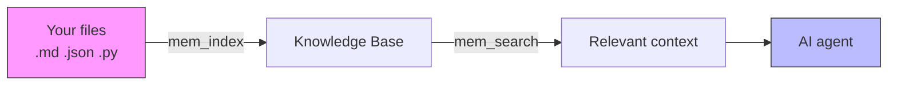
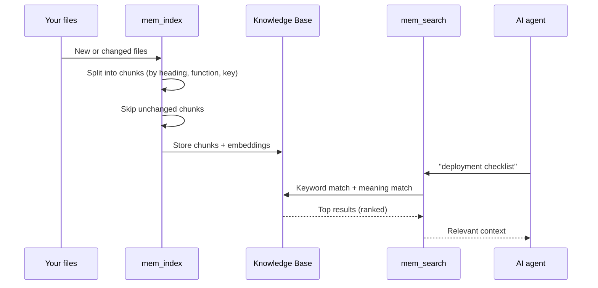

# memtomem Reference

**Audience**: Users who have completed the [Getting Started](getting-started.md) guide
**Prerequisites**: memtomem installed, MCP server connected to your AI editor

> **New to memtomem?** Start with [Getting Started](getting-started.md), or use the [Korean Claude Code/Codex quickstart](vibe-coding-getting-started-ko.md) for a plugin-first path. This guide is a complete reference for all features.

**On this page**

- [Glossary](#glossary)
- [How memtomem Works](#how-memtomem-works)
- [MCP Tools at a Glance](#mcp-tools-at-a-glance)

**Reference pages**

- [Core memory tools](reference/core-memory-tools.md) — indexing, search, and CRUD (`mem_index`, `mem_search` / `mem_recall`, `mem_add` / `mem_edit` / `mem_delete`)
- [Organization & maintenance](reference/organization-maintenance.md) — namespaces and upkeep (`mem_ns_*`, dedup / decay / auto-tag, `mm memory doctor`)
- [Automation](reference/automation.md) — memory policies and scheduled jobs (`mem_policy_*`, `mm schedule`)
- [Data, config & CLI](reference/data-config-cli.md) — export / import / ingest, `mem_stats` / `mem_config`, the full CLI reference, moving artifacts between tiers
- [Operations](reference/operations.md) — Web UI, troubleshooting, STM proactive surfacing, uninstalling

---

## Glossary

| Term | Meaning |
|------|---------|
| **MCP** | Model Context Protocol — how your AI editor talks to memtomem |
| **Embedding** | A numeric vector that represents the meaning of text |
| **BM25** | Keyword-based search algorithm (like Google, but local) |
| **Dense search** | Meaning-based search using embeddings |
| **Hybrid search** | BM25 + dense combined — the default in memtomem |
| **RRF** | Reciprocal Rank Fusion — the algorithm that merges keyword and meaning results |
| **Chunk** | A section of a file (one heading, one function, one key) — the unit of indexing |
| **Namespace** | A label to organize memories (e.g., "work", "personal", "project-x") |
| **`mem_do`** | Meta-tool that routes to all non-core actions (with aliases). Use `mem_do(action="help")` to list all |

### The three "modes"

Three unrelated settings all use the word *mode* — they control different axes and don't interact:

| Mode | Values | What it controls |
|------|--------|------------------|
| **View toggle** (Web UI header) | Simple / Advanced | Which *tabs and sections* the Web UI shows in your browser session. Purely cosmetic — flip the **Advanced** switch in the header. |
| **Web surface** (`mm web --mode`, `MEMTOMEM_WEB__MODE`) | `prod` / `dev` | Which *pages and API endpoints* the web server exposes. `dev` adds maintainer pages (Sessions, Health Report, …) and structural namespace verbs. See [Operations → Web UI](reference/operations.md#web-ui). |
| **Tool mode** (`MEMTOMEM_TOOL_MODE`) | `core` / `standard` / `full` | How many *MCP tools* the server registers for your editor. `core` (default) exposes 9 tools and routes the rest through `mem_do`. See [Configuration](configuration.md). |

---

## How memtomem Works

**Index once, search forever.** memtomem reads your files, breaks them into meaningful chunks, and builds a searchable index. When your AI agent needs context, it searches by both keywords and meaning to find the most relevant pieces.

Your `.md` files are the source of truth. The index is a rebuildable cache — delete it anytime and re-index.

### What happens under the hood

---

## MCP Tools at a Glance

memtomem provides **99 current MCP tools** organized into categories. Full mode
also registers the deprecated `mem_context_migrate` compatibility alias (100
registered names total):

| Category | Tools | What they do |
|----------|-------|-------------|
| **Search** | `mem_search`, `mem_recall` | Find memories by meaning or by date |
| **CRUD** | `mem_add`, `mem_batch_add`, `mem_edit`, `mem_delete` | Create, update, remove memories |
| **Indexing** | `mem_index` | Build the knowledge base from files |
| **Namespace** | `mem_ns_list/set/get/assign/update/rename/delete` | Organize memories into groups |
| **Maintenance** | `mem_dedup_scan/merge`, `mem_decay_scan/expire`, `mem_auto_tag` | Keep the index clean |
| **Data** | `mem_export`, `mem_import` | Backup and restore |
| **Ask** | `mem_ask` | Natural-language Q&A over indexed memories (requires LLM) |
| **Health** | `mem_watchdog`, `mem_cleanup_orphans` | System health checks and orphan cleanup |
| **Relations** | `mem_link`, `mem_unlink`, `mem_related` | Cross-reference links between chunks |
| **Working Memory** | `mem_scratch_set/get/promote` | Ephemeral key-value scratch space |
| **Config** | `mem_stats`, `mem_status`, `mem_config`\*, `mem_embedding_reset`\*, `mem_reset`\* | Monitor and configure |
| **Pinned Context** | `mem_pinned_list/get/set/delete`, `mem_context_compose` | Keep bounded instructions ahead of retrieved memory |
| **Formation** | `mem_formation_scan`, `mem_candidate_propose/list/review/recover` | Submit and review proposed memories and recover interrupted approvals |

\* Exposed as an individual tool only under `MEMTOMEM_TOOL_MODE=full`. The actions stay reachable in `core` and `standard` mode through the dispatcher — `mem_do(action="config", params={...})`, `mem_do(action="embedding_reset", params={...})`, `mem_do(action="reset", params={...})` — and the CLI equivalents are `mm config`, `mm embedding-reset`, and `mm reset`.

### `mem_do` action naming convention

In **core** tool mode (default), most features are accessed through `mem_do(action="...")`. Action names follow these conventions:

- **Namespace actions** use `ns_` prefix: `ns_list`, `ns_set`, `ns_assign`, `ns_rename`, `ns_delete`
- **Session actions** use `session_` prefix: `session_start`, `session_end`, `session_list`
- **Scratch (working memory)** uses `scratch_` prefix: `scratch_set`, `scratch_get`, `scratch_promote`
- **Maintenance** uses descriptive names: `dedup_scan`, `decay_expire`, `cleanup_orphans`
- **Analytics** uses short names: `eval`, `activity`, `timeline`, `reflect`

Use `mem_do(action="help")` to see all available actions, or `mem_do(action="help", params={"category": "sessions"})` for per-category details with parameter descriptions. Common aliases are supported (e.g. `health_report` → `eval`, `namespace_set` → `ns_set`).

### Context tool parameters

The `mem_context_*` tools (CLI: `mm context`) push canonical artifacts — skills, sub-agents, commands, MCP-server definitions — out to AI runtimes. See the [Context Gateway](context-gateway.md) guide for the Store → Push → Runtime model, and [Moving artifacts between tiers and projects](reference/data-config-cli.md#moving-artifacts-between-tiers-and-projects) for the `move`/`copy`/`migrate` transfer verbs. The parameter surface:

- **All context tools** accept `include="skills,agents,commands"` to scope a canonical artifact workflow.
- **`init`, `generate`, `sync`, `diff`, `version`, `promote`** accept `scope="project_shared|user|project_local"` — the canonical **tier** (ADR-0016 §2).
- **`generate` / `sync`** also accept `on_drop="ignore|warn|error"` (the legacy alias `strict=True` ≡ `on_drop="error"`) to control how dropped sub-agent or command fields are reported, and `label="latest|v1|production"` to deploy from a specific version snapshot (agents/commands only).
- **`version`** manages snapshots via `action="list"|"create"|"enable"` — `enable` adopts a flat-layout artifact into directory layout (a byte-identical, same-scope move) so it can be versioned, mirroring `mm context version enable` and the web `POST …/versions/enable` route (`confirm_project_shared=True` for the git-tracked tier).
- **`promote`** moves or deletes label pointers to versions.
- **`memory_migrate`** takes `from_scope`/`to_scope` instead of a single `scope` (it has two endpoints), plus `apply=True` to execute and `confirm_project_shared=True` when writing to the git-tracked tier. (`mem_context_migrate` is a deprecated alias for `mem_context_memory_migrate`.)
- **`artifact_migrate`** migrates agents/commands/skills — flat→dir layout when `to_scope` is omitted, or a scope-tier move when it is set (`apply=True` to execute, `force=True` for a dirty flat→dir, `confirm_project_shared=True` for the git-tracked tier).
- **`artifact_transfer`** moves or copies one canonical artifact between tiers and/or registered projects — `mode="move"|"copy"`, `to_project_scope_id` (from `mm context projects list`), `as_name` for a renamed copy, and `asset_type="mcp-servers"` for cross-project MCP-server definition copies (`apply=True` to execute, `confirm_project_shared=True` for the git-tracked tier, `allow_host_writes=True` for a user-tier landing).
- **`pull`** brings one runtime's copy of a `kind="skills|agents|commands"` artifact (`name=…`) back into the canonical Store — the reverse of `sync`/push. Dry-run preview by default; `apply=True` executes. `from_runtime` selects the source (required when runtime copies diverge — ADR-0030 §5), `scope="user|project_shared"` the destination tier (explicit for the git-tracked tier — ADR-0030 §11; `project_local` is rejected), `overwrite=True` replaces an existing Store entry (agents/commands snapshot first; skills not yet supported), `confirm_project_shared=True` / `allow_host_writes=True` for the git-tracked / user-tier landing, and `force_unsafe_import=True` (literal) to bypass Gate A for a reviewed false positive on the user tier only. Mirrors `mm context pull` and the web Pull route.

> **CLI/web-only (no MCP verb).** Wiki→project install/update (`mm context install`/`update`) and the projects registry (`mm context projects {list, add, resume}`) are intentionally not exposed as `mem_context_*` tools — they write into a project's `.memtomem/` tree or mutate cross-project enrollment state, so they run from the CLI or the dev-tier Web UI only (ADR-0008). A headless agent that hits an `artifact_transfer` refusal naming one of these (unknown / paused / discovery-only destination) must run the printed `mm context projects …` command at a terminal; there is no MCP equivalent to retry with.

---

## Next Steps

- [한국어 바이브코딩 빠른 시작](vibe-coding-getting-started-ko.md) — Claude Code·Codex CLI plugin-first onboarding
- [Configuration](configuration.md) — All `MEMTOMEM_*` environment variables
- [Embeddings](embeddings.md) — ONNX, Ollama, OpenAI providers
- [LLM Providers](llm-providers.md) — Optional LLM features (auto-tag, entity extraction, ask)
- [MCP Client Setup](mcp-clients.md) — Editor-specific configuration
- [memtomem-stm](https://github.com/memtomem/memtomem-stm) — Proactive surfacing, compression, caching (separate package)
- [Full Tool Reference](../../packages/memtomem/README.md) — All current tools with parameters
