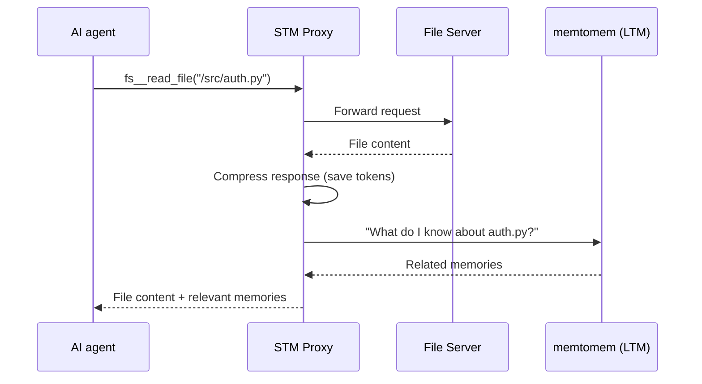

# Operations & troubleshooting

Running the Web UI, fixing common problems, optional STM proactive surfacing, and uninstalling.

[← memtomem Reference](../reference.md)

**On this page**

- [Web UI](#web-ui)
- [Troubleshooting](#troubleshooting)
- [STM: Proactive Memory Surfacing (Optional)](#stm-proactive-memory-surfacing-optional)
- [Uninstalling memtomem](#uninstalling-memtomem)

---

## Web UI

```bash
mm web                         # http://localhost:8080 (prod surface)
mm web --port 3000             # custom port
mm web -b --port 3000          # run in the background
mm web status                  # show pid/port/start time
mm web stop                    # stop the tracked Web UI process
mm web --dev                   # adds opt-in maintainer pages
mm web --mode {prod,dev}       # explicit mode (mutually exclusive with --dev)
```

`mm web` opens in **Simple** mode by default, showing the Home, Search, Sources, Gateway, Index, and Settings tabs. The **Gateway** tab is the Context Gateway surface (Overview, Projects, Skills, Commands, Subagents, MCP Servers, Hooks, Wiki); the **Settings** tab holds Config, Namespaces, and Reset Database. Flip the header's **Advanced** toggle to reveal the Tags and Timeline tabs, plus the Dedup, Age-out, and Export/Import sections inside Settings. `mm web --dev` — or setting `MEMTOMEM_WEB__MODE=dev` in your shell profile — extends the surface with maintainer pages (Sessions, Working Memory, Procedures, Health Report) and unlocks structural namespace verbs (rename, delete) that are dev-only by ADR-0007.

Tab classification changes over time — run `mm web --dev` against your installed version to see the complete surface. The API endpoints backing dev-only pages return 404 in `prod` mode; scripts that hit `/api/sessions`, `/api/scratch`, `/api/namespaces/{ns}/rename`, `DELETE /api/namespaces/{ns}`, etc. need `dev` mode. `GET /api/namespaces` (list) and `PATCH /api/namespaces/{ns}` (cosmetic edit — color, description) are prod-tier and respond in both modes.

---

## Troubleshooting

### "No results found"

1. `mem_stats()` — Check that chunks > 0
2. `mem_index(path="~/notes")` — Re-index
3. Remove filters and try a broader query

### Embedding errors

1. Ollama: `ollama list` to verify model is pulled
2. OpenAI: check `mem_config(key="embedding.api_key")`
3. Check mismatch: `mm embedding-reset` (CLI) or `mem_embedding_reset()` (MCP)
4. Reset to current model: `mm embedding-reset --mode apply-current` then `mm index ~/notes`

### MCP tools not visible

1. Fully quit and relaunch your MCP client
2. Verify config file path (see [MCP Clients](../mcp-clients.md))
3. `mem_status` — Confirm connection

### MCP server directory changed

If you moved or renamed your memtomem source directory:

1. Update the `--directory` path in your MCP config:
   - **Claude Code**: `claude mcp add memtomem -s user -- uv run --directory /new/path memtomem-server`
   - **Cursor/Windsurf**: edit `mcp.json` and update the `args` array
2. Restart or reconnect the MCP server from your editor (e.g., `/mcp` → Reconnect in Claude Code)
3. If reconnect fails, fully quit and relaunch the editor

### Slow search

1. Reduce `top_k` (default 10)
2. `mem_config(key="search.bm25_candidates", value="30")` — Reduce candidate pool
3. Disable one retriever if sufficient: `mem_config(key="search.enable_bm25", value="false")`

### "database is locked"

SQLite allows only one writer at a time. If the MCP server and Web UI server both try to write simultaneously, one will get a lock error. Solutions:
1. Run only one write-capable server at a time (read operations are fine concurrently)
2. Retry the operation — the lock is typically brief
3. For production, use a single server process

### Concurrent MCP + Web server

Running both `memtomem-server` (MCP) and `memtomem-web` simultaneously is supported but has caveats:

- **File watcher overlap**: both servers watch `memory_dirs`. A file created by one server may be re-indexed by the other, causing duplicate chunks. Restart the server that has stale data, or force a full re-index (`mem_index(force=True)`) to reconcile.
- **Orphaned index entries**: interrupted concurrent writes could previously leave orphaned FTS/vec entries causing `constraint failed` errors on subsequent indexing. This is now handled automatically — `upsert_chunks` defensively cleans orphans before INSERT.
- **Recommendation**: for typical usage, run only the MCP server. Launch the Web UI on-demand when you need visual browsing.

---

## STM: Proactive Memory Surfacing (Optional)

The **[memtomem-stm](https://github.com/memtomem/memtomem-stm)** package adds a proxy that sits between your AI agent and other MCP servers. It automatically recalls relevant memories when your agent uses any tool. STM is distributed as a separate package; it communicates with memtomem core entirely through the MCP protocol — no direct code coupling.

### How it works



The agent gets both the tool response and your previous notes about the topic — without asking.

### Install

```bash
pip install memtomem-stm
```

For setup, CLI usage, compression strategies, surfacing configuration, and the full tool list, see the [memtomem-stm README](https://github.com/memtomem/memtomem-stm#readme).

---

## Uninstalling memtomem

See [`uninstall.md`](../uninstall.md) for the five-step removal flow: detach the MCP server from each editor, uninstall the Python package, delete `~/.memtomem/`, clean up project-scoped `.memtomem/` and generated rule files, and optionally prune memtomem hooks from `~/.claude/settings.json`.

---
