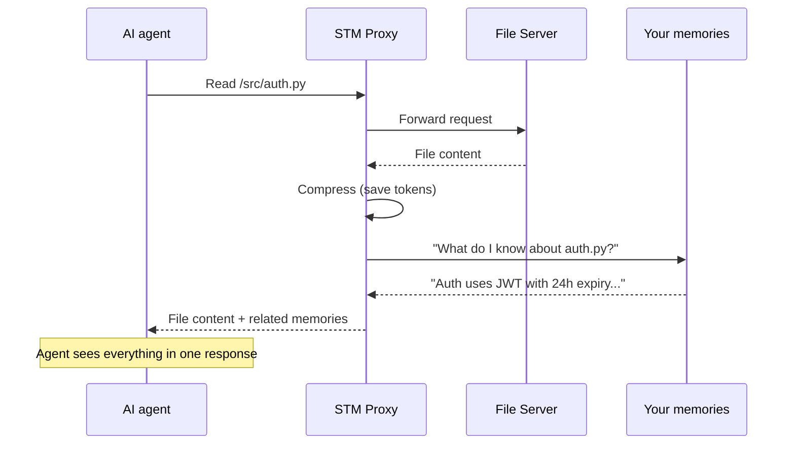

# STM Proxy Gateway Guide

**Audience**: Users who want proactive memory surfacing (automatic recall)
**Prerequisites**: [Getting Started](getting-started.md) complete, memtomem working
**Difficulty**: Intermediate — STM is optional. Basic search/add works without it.

---

## Do I need STM?

| Without STM | With STM |
|------------|---------|
| You manually search: "What do I know about auth?" | Agent reads `auth.py` → related memories appear automatically |
| Each tool call is independent | Tool calls are enriched with relevant context |
| You control when to search | Memories surface proactively, like human recall |

**Start without STM.** If you find yourself repeatedly searching for context that your agent should already know, STM is for you.

---

## What is STM?

Your AI agent uses many tools — reading files, searching docs, calling APIs. **STM makes the agent automatically remember** what it learned before about each topic. No manual searching needed.



STM does two things:
1. **Surfaces** relevant memories automatically when the agent uses any tool
2. **Compresses** large tool responses to save tokens

---

## Quick Setup (recommended)

The easiest way to set up STM:

```bash
# 1. Install
pip install "memtomem-stm[ltm]"            # PyPI
# or: uv pip install -e "packages/memtomem-stm[ltm]"  # source

# 2. Run the interactive wizard
mm stm init
```

The `mm stm init` wizard will:
1. Detect your MCP client (Claude Code, Cursor, etc.) and list connected servers
2. Let you choose which servers to proxy through STM
3. Assign short prefixes (e.g., `fs__read_file`, `gh__search`)
4. Choose a compression strategy
5. Enable response cache (avoid redundant upstream calls)
6. Configure Langfuse tracing (optional, for observability)
7. Write `~/.memtomem/stm_proxy.json`
8. Enable STM in your memtomem config

Each step supports `b` (back) and `q` (quit).

### Undo / Disable STM

To disable STM and restore your original MCP server configs:

```bash
mm stm reset
```

This will:
1. Restore proxied servers back to your editor's MCP config
2. Set `stm_proxy.enabled = false` in memtomem config
3. Remove `~/.memtomem/stm_proxy.json`
4. Restart your editor to apply changes

---

## Manual Installation

### Option A: Integrated mode (recommended)

Runs STM inside the memtomem server. Zero-latency in-process surfacing.

```bash
pip install "memtomem-stm[ltm]"
```

### Option B: Standalone mode

Runs as a separate MCP server. Connects to memtomem via MCP protocol.

```bash
pip install memtomem-stm
```

---

## Setup

### 1. Add upstream servers

Register the MCP servers you want to proxy:

```bash
# Filesystem access
memtomem-stm-proxy add filesystem \
  --command npx \
  --args "-y @modelcontextprotocol/server-filesystem /home/user/projects" \
  --prefix fs

# GitHub
memtomem-stm-proxy add github \
  --command npx \
  --args "-y @modelcontextprotocol/server-github" \
  --prefix gh \
  --env GITHUB_TOKEN=ghp_xxx

# Any MCP server via SSE
memtomem-stm-proxy add docs \
  --transport sse \
  --url http://localhost:3000/sse \
  --prefix docs \
  --compression selective
```

### 2. Configure your MCP client

**Integrated mode** — add to your memtomem MCP config:

```json
{
  "mcpServers": {
    "memtomem": {
      "command": "uvx",
      "args": ["--from", "memtomem", "memtomem-server"],
      "env": {
        "MEMTOMEM_INDEXING__MEMORY_DIRS": "~/notes",
        "MEMTOMEM_STM_PROXY__ENABLED": "true"
      }
    }
  }
}
```

**Standalone mode** — add as a separate MCP server:

```json
{
  "mcpServers": {
    "memtomem": {
      "command": "uvx",
      "args": ["--from", "memtomem", "memtomem-server"]
    },
    "memtomem-stm": {
      "command": "memtomem-stm"
    }
  }
}
```

### 3. Verify

Your agent should now see proxied tools like `fs__read_file`, `gh__search_repositories`, etc. Call `stm_proxy_stats` to check status.

---

## Compression Strategies

Each upstream server can use a different compression strategy:

| Strategy | Best for | How it works |
|----------|----------|-------------|
| **hybrid** (default) | Most responses | Preserves first 5K chars + TOC for remainder |
| **selective** | Dense/large | 2-phase: returns TOC first, agent picks sections |
| **truncate** | Simple text | Section-aware for markdown (lists remaining headings), sentence-boundary for plain text |
| **extract_fields** | JSON APIs | Preserves key structure, shows first key-value pairs of nested dicts |
| **llm_summary** | Dense content | LLM summarization (requires API key) |
| **none** | Short responses | Pass-through, cache only |

### Auto-strategy selection

When you're unsure which strategy to use, STM can auto-detect the best one based on content type:

| Content type | Auto-selected strategy |
|-------------|----------------------|
| JSON (`{...}` or `[...]`) | `extract_fields` |
| Markdown (3+ headings) | `hybrid` |
| Code-heavy (2+ code blocks) | `hybrid` |
| Plain text | `truncate` |

The `auto_select_strategy()` function is available for programmatic use. To use it, omit the `compression` field in server config and let the proxy choose per-response.

### Selective compression (2-phase)

Phase 1: STM parses the response into sections and returns a compact TOC:

```json
{
  "type": "toc",
  "selection_key": "abc123",
  "entries": [
    {"key": "Installation", "type": "heading", "size": 450, "preview": "..."},
    {"key": "API Reference", "type": "heading", "size": 8200, "preview": "..."}
  ],
  "hint": "Call stm_proxy_select_chunks(key='abc123', sections=[...]) to retrieve."
}
```

Phase 2: Agent calls `stm_proxy_select_chunks` to get only the sections it needs.

### Per-tool overrides

Override compression for specific tools in `~/.memtomem/stm_proxy.json`:

```json
{
  "upstream_servers": {
    "filesystem": {
      "prefix": "fs",
      "command": "npx",
      "args": ["-y", "@modelcontextprotocol/server-filesystem", "/home/user"],
      "compression": "selective",
      "max_result_chars": 2000,
      "tool_overrides": {
        "read_file": {
          "compression": "hybrid",
          "max_result_chars": 5000
        },
        "list_directory": {
          "compression": "truncate",
          "max_result_chars": 1000
        }
      }
    }
  }
}
```

---

## Proactive Surfacing

### How context is extracted

STM extracts a search query from each tool call:

1. **Per-tool template**: `"query_template": "file {arg.path}"` → `"file /src/auth.py"`
2. **Agent passthrough**: `_context_query` argument → used as-is
3. **Path tokenization**: `/src/auth/jwt_handler.py` → `"src auth jwt handler py"` (auto-split on `/._-`)
4. **Heuristic**: tool name + string arguments (UUIDs and hex strings excluded)

### Surfacing safeguards

STM applies multiple safeguards to prevent surfacing from becoming intrusive:

| Safeguard | Default | Effect |
|-----------|---------|--------|
| **Write-tool filter** | `*write*`, `*create*`, `*delete*`, etc. | Skips surfacing for mutating operations |
| **Rate limit** | 15/min | Prevents excessive surfacing in burst activity |
| **Cooldown** | 5s | Suppresses near-identical queries (Jaccard > 0.95) |
| **Min response size** | 5000 chars | Short responses don't trigger surfacing |
| **Session dedup** | On | Same memory ID not shown twice in one session |
| **Injection size cap** | 2000 chars | Memory block truncated if too large |
| **Circuit breaker** | 3 failures / 60s reset | Stops surfacing if LTM search keeps failing |
| **Timeout** | 3s | Falls back to original response if search is slow |

### Surfacing configuration

```bash
# Environment variables
export MEMTOMEM_STM_SURFACING__MIN_SCORE=0.35
export MEMTOMEM_STM_SURFACING__MAX_RESULTS=3
export MEMTOMEM_STM_SURFACING__TIMEOUT_SECONDS=3.0
export MEMTOMEM_STM_SURFACING__MAX_SURFACINGS_PER_MINUTE=15
```

### Per-tool surfacing overrides

```json
{
  "surfacing": {
    "context_tools": {
      "read_file": {
        "query_template": "file {arg.path}",
        "namespace": "code-notes",
        "min_score": 0.4
      },
      "search_issues": {
        "min_score": 0.5,
        "max_results": 2
      },
      "get_weather": {
        "enabled": false
      }
    }
  }
}
```

---

## Feedback & Auto-Tuning

### Rating surfaced memories

When memories are surfaced, a surfacing ID is shown. Rate it to improve future results:

```
→ stm_surfacing_feedback(surfacing_id="abc123", rating="helpful")
→ stm_surfacing_feedback(surfacing_id="def456", rating="not_relevant")
→ stm_surfacing_feedback(surfacing_id="ghi789", rating="already_known")
```

### Auto-tuning

When enabled (default), STM automatically adjusts the `min_score` threshold per tool:

- **>60% not_relevant** feedback → raises threshold (fewer, more relevant surfacings)
- **<20% not_relevant** feedback → lowers threshold (more surfacings)
- **20–60%** → no change (stable band)

Requires at least 20 feedback samples per tool before adjusting. **Cold-start fallback**: new tools with insufficient samples use the global ratio across all tools instead of waiting for 20 per-tool samples.

### Search boost from feedback

When you rate memories as "helpful", their `access_count` is incremented in the core search index. With `access_config.enabled=True`, this creates a positive feedback loop:

```
surface → user rates helpful → access_count++ → higher search ranking → more likely to surface
```

**Safeguards** prevent this loop from becoming runaway:
- Each surfacing event can only boost once (duplicate feedback on same ID ignored)
- `max_boost=1.5` caps the score multiplier (logarithmic scaling)
- Same memory won't surface again within the same session (session dedup)

### Check effectiveness

```
→ stm_surfacing_stats()
→ stm_surfacing_stats(tool="read_file")
```

---

## Response Caching

Enable SQLite-backed caching to avoid redundant upstream calls:

```json
{
  "cache": {
    "enabled": true,
    "db_path": "~/.memtomem/proxy_cache.db",
    "default_ttl_seconds": 3600
  }
}
```

Manage cache:

```
→ stm_proxy_cache_clear()                    # clear all
→ stm_proxy_cache_clear(server="filesystem") # clear specific server
```

---

## Langfuse Tracing

Langfuse records every proxy call for observability, debugging, and cost analysis. Requires a running [Langfuse](https://langfuse.com) instance (self-hosted or cloud).

### Via `mm stm init`

The wizard asks at step 6 — provide your Langfuse host and API keys.

### Manual setup

Set environment variables before starting memtomem:

```bash
export MEMTOMEM_STM_LANGFUSE__ENABLED=true
export MEMTOMEM_STM_LANGFUSE__HOST=http://localhost:3000   # self-hosted
export MEMTOMEM_STM_LANGFUSE__PUBLIC_KEY=pk-lf-...
export MEMTOMEM_STM_LANGFUSE__SECRET_KEY=sk-lf-...
```

Or save to a file and load:

```bash
# mm stm init creates this automatically
cat ~/.memtomem/stm_langfuse.env
# MEMTOMEM_STM_LANGFUSE__ENABLED=true
# MEMTOMEM_STM_LANGFUSE__HOST=http://localhost:3000
# MEMTOMEM_STM_LANGFUSE__PUBLIC_KEY=pk-lf-...
# MEMTOMEM_STM_LANGFUSE__SECRET_KEY=sk-lf-...

export $(cat ~/.memtomem/stm_langfuse.env | xargs)
```

For **Claude Code MCP config**, add the env vars:

```json
{
  "mcpServers": {
    "memtomem": {
      "command": "uvx",
      "args": ["--from", "memtomem", "memtomem-server"],
      "env": {
        "MEMTOMEM_STM_LANGFUSE__ENABLED": "true",
        "MEMTOMEM_STM_LANGFUSE__HOST": "http://localhost:3000",
        "MEMTOMEM_STM_LANGFUSE__PUBLIC_KEY": "pk-lf-...",
        "MEMTOMEM_STM_LANGFUSE__SECRET_KEY": "sk-lf-..."
      }
    }
  }
}
```

The STM dashboard in the Web UI shows a **Langfuse** badge when tracing is active.

---

## Privacy & Content Cleaning

STM cleans tool responses before compression:

- **HTML/JSX stripping**: removes tags, preserves code fences and TypeScript generics
- **`<script>`/`<style>` removal**: content and tags fully stripped (not just tags)
- **Paragraph dedup**: repeated paragraphs appear only once
- **Link flood collapse**: paragraphs with 80%+ links replaced with `[N links omitted]`

STM also detects sensitive content (API keys, passwords, PII, SSH keys) in tool responses. When detected:

- LLM compression is blocked (falls back to local truncate/selective)
- Content is never sent to external APIs

---

## LLM Compression Setup

To use LLM-based summarization:

```json
{
  "upstream_servers": {
    "docs": {
      "prefix": "docs",
      "compression": "llm_summary",
      "llm": {
        "provider": "openai",
        "model": "gpt-4o-mini",
        "api_key": "sk-...",
        "max_tokens": 500
      }
    }
  }
}
```

Supported providers: `openai`, `anthropic`, `ollama`.

---

## CLI Commands

```bash
memtomem-stm-proxy status    # show config, servers, enabled status
memtomem-stm-proxy list      # list upstream servers
memtomem-stm-proxy add ...   # add upstream server
memtomem-stm-proxy remove    # remove upstream server
```

---

## Web UI Monitoring

When STM is installed and enabled, the Web UI automatically shows an **STM tab** between Timeline and More:

```bash
mm web     # open http://localhost:8080, click the STM tab
```

The dashboard shows:
- **Status badges**: active/disabled, server count, surfacing, cache
- **Server cards**: each upstream server with prefix, transport, compression
- **Compression metrics**: total calls, original/compressed chars, savings % (filterable by period)
- **Breakdown tables**: by server and by tool (click to filter history)
- **Cache & Surfacing**: cache stats with clear button, surfacing feedback with helpfulness %
- **Call history**: paginated table with server/tool filter, auto-refreshes every 10 seconds

See [Web UI Guide](web-ui.md#stm-proxy-dashboard) for full details.

---

## Deployment Modes

| Mode | Install | Surfacing | Use case |
|------|---------|-----------|----------|
| **Integrated** | `pip install "memtomem-stm[ltm]"` + `MEMTOMEM_STM_PROXY__ENABLED=true` | In-process (zero latency) | Primary setup |
| **Standalone + LTM** | `pip install "memtomem-stm[ltm]"` | In-process | Separate MCP server |
| **Standalone** | `pip install memtomem-stm` | MCP client to remote memtomem | Decoupled |

---

## Next Steps

- [User Guide](user-guide.md) — Complete memtomem feature walkthrough
- [Agent Memory Guide](agent-memory-guide.md) — Sessions, working memory, procedures
- [STM README](../../packages/memtomem-stm/README.md) — Package reference
